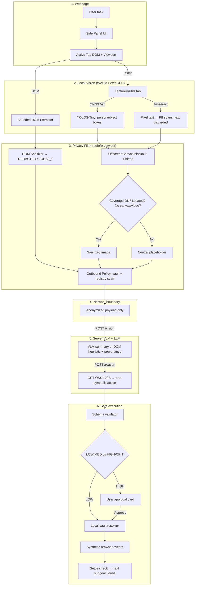

# 🛡️ PrivAgent — Privacy-Preserving Vision Agent for the Browser

[](https://www.sih.gov.in/)
[](https://developer.chrome.com/docs/extensions/mv3/)
[](https://extensionworkshop.com/)
[](#-1-local-vision-processing-client-side)
[](#-2-privacy-preserving-filter-before-any-network-call)
[](#-testing--verification)
[](docs/REUSE_AND_ATTRIBUTION.md)

> **Server sees structure. Never secrets.**
> A local Vision Transformer reads your screen *inside the browser*, redacts faces / passwords / PII on-device, and only then sends anonymized context to a redaction-aware server VLM + LLM that returns safe browser actions.

**Stack:** `Transformers.js + ONNX Runtime Web (WASM SIMD / WebGPU) + Tesseract.js OCR` on client · `FastAPI + open-weights VLM + GPT-OSS 120B` on server · `Manifest V3` on Chrome & Firefox.

---

## 🎯 30-Second Brief for Evaluators

| # | Official metric (100%) | Live check (3 min) | What PrivAgent shows |
|---|---|---|---|
| 1 | **Visual context accuracy — 25%** | Side Panel → run any portal task | Local YOLOS-Tiny + OCR locate people/text regions; server VLM returns `spatial_layout` + `visual_state` prose with provenance (`REAL_VLM` / `DOM_PLUS_HEURISTIC` / `DOM_ONLY`). Controls stay DOM-grounded for precision. |
| 2 | **PII recall & precision — 20%** | Open `/government-aadhaar.html`, `/page-b-sensitive-form.html` | DOM signals (`type=password`, `autocomplete`, aria) × pixel OCR × checksum-verified registry: Aadhaar, PAN, cards, SSN/SIN/NIN/NHS/IBAN, IFSC, email, phone, DOB, OTP/password. |
| 3 | **Redaction precision — 20%** | Same pages | `OffscreenCanvas` solid blackout + 3px bleed + `[REDACTED_*]` labels; fail-closed placeholder when coverage is uncertain; OCR text never leaves device. |
| 4 | **Client resource use — 20%** | Side Panel → Settings → Developer diagnostics | Quantized `model_q4.onnx`, bundled WASM + lang data, **0 bytes** runtime download; `heap` / `asset_bytes` / per-stage timings exported. |
| 5 | **End-to-end latency — 15%** | Side Panel diagnostics per step | Detection + OCR run concurrently; one symbolic action per planning call; provider failover to DOM heuristic. Per-stage timings visible live. |

**3-minute demo:** `python3 test-server/app.py` → load `dist/chrome/` → open `/government-aadhaar.html` → type *"Fill this form with my saved profile"* → watch PII blacked out locally → approve submit on confirmation card → done. Vault values are resolved locally at execution time only.

---

## 📌 Problem Statement → Our Answer

**Background (summary):** Agentic AI needs screen context, but server-side pipelines force users to share sensitive pixels. A local browser agent with lightweight on-device vision (WebGPU/WASM + ONNX/Transformers.js) can keep secrets local and send only structure to the cloud for reasoning.

**What was asked:** Build a browser vision agent where a local ViT reads the screen, sanitizes PII *before any network request* (DOM tags or any method), dynamically redacts faces/passwords/PII, transmits only anonymized data to a redaction-aware server, which returns executable commands. Balance latency vs. accuracy.

**Expected prototype = extension + server:**

| Expected component | PrivAgent implementation | Code |
|---|---|---|
| **Client: Local Vision Processing (WebGPU)** | Packaged **YOLOS-Tiny ViT** (pinned `Xenova/yolos-tiny`) on ONNX Runtime Web (WASM SIMD, WebGPU where available) + **Tesseract.js OCR**, run in parallel in the side panel | `extension/perception/local-vision.js`, `extension/runtime/model-runtime.js` |
| **Client: Privacy-Preserving Filter (bbox redaction / masking)** | **Dual engine:** DOM Sanitizer (values → `[REDACTED]` / `LOCAL_*`) + Screenshot Sanitizer (pixels → blackout). Outbound Policy Engine blocks any raw leak | `extension/privacy/dom-sanitizer.js`, `extension/privacy/screenshot-sanitizer.js`, `extension/privacy/policy-engine.js` |
| **Server: Anonymized context → LLM/VLM → UI action** | `POST /vision` (layout summary) → `POST /reason` (one symbolic action: `CLICK`/`TYPE`/`SUBMIT`/`SCROLL`…) → local validate → risk-gate → vault-resolve → synthetic browser event | `backend/server.py`, `backend/vlm_service.py`, `backend/gpt_oss_service.py`, `extension/executor/`, `extension/content/content.js` |
| **Open-weights model (cloud allowed in SIH)** | Reasoning `gpt-oss-120b` (OpenAI-compatible); Vision rotatable OpenRouter / HF / Groq; Bedrock supported | `backend/config.py`, `docs/model-providers.md` |
| **End-to-end assistive task** | 14-state agent loop + 11 local benchmark portals + human-in-the-loop approvals | `extension/background/agent-controller.js`, `test-server/app.py` |
| **Chrome + Firefox** | MV3 Side Panel (Chrome) + MV3 Sidebar (Firefox), one-command builds | `extension/manifest.json`, `extension/manifest.firefox.json`, `scripts/package-extension.mjs` |

✅ **Coverage verdict:** every line of the Expected Solution is implemented and demonstrable. See [Evaluation Scorecard](#-evaluation-scorecard--how-to-verify-each-metric) for exactly where judges should click.

---

## ✨ Why This Wins — 5 Things Judges Remember

1. **Real on-device ViT, not a mock.** Quantized detection + OCR actually run in the extension. Disconnect the network and redaction still works.
2. **Fail-closed by design.** No box? No coverage? Canvas/video surface? → neutral `Screenshot withheld (N masked regions)` placeholder goes out, never raw pixels.
3. **Checksums kill false positives.** Luhn / Mod-11 / Mod-97 + proximity gating lets order IDs and travel dates stay useful while real IDs get masked.
4. **Server knows about the masks.** Redaction counts travel with the payload; VLM prompt says *"Black regions are privacy masks: do not infer or reconstruct"*; fabricated PII in VLM output is discarded + provider rotated.
5. **Secrets never cross the wire.** Cloud sees only `LOCAL_AADHAAR`, `LOCAL_PASSWORD`, etc. Plaintext is swapped in from `chrome.storage.local` at the last millisecond, inside the browser.

---

## 🏗️ How It Works



<details>
<summary>📋 Text version</summary>

```
[ PAGE ] → [ DOM extractor ] → [ DOM sanitizer → LOCAL_* ]
    ↓
[ Viewport pixels ] → [ YOLOS-Tiny + Tesseract ] → [ boxes ]
    ↓
[ Screenshot sanitizer: blackout, or placeholder if uncertain ]
    ↓
[ Outbound policy blocks raw leaks ] → [ backend ]
    ↓
[ VLM prose or DOM heuristic ] → [ GPT-OSS planner: 1 action ]
    ↓
[ Validator → Risk gate → (approval) → Vault resolver → Executor ]
```

</details>

### 🤖 14-State Agent Loop

`IDLE → UNDERSTANDING_TASK → OBSERVING → SANITIZING → VISUAL_ANALYSIS → REASONING → PLANNING → VALIDATING_ACTION → EXECUTING (or WAITING_FOR_USER) → VERIFYING → OBSERVING … → COMPLETED / FAILED / CANCELLED`

Governed by `extension/background/agent-controller.js`. Every step records per-stage timings for the latency metric.

---

## 🖥️ 1. Local Vision Processing (Client-Side)

- `extension/perception/local-vision.js` — loads pinned `model_q4.onnx`, runs detection + OCR concurrently. Returns `people`, `piiRegions`, `safeToTransmitAfterRedaction`, `backend` (wasm/webgpu), `modelLoadMs` / `inferenceMs` / `totalMs`, heap + asset bytes.
- `extension/runtime/model-runtime.js` — packaged ONNX loader, no CDN at runtime.
- `extension/perception/screenshot.js` — viewport capture; `observation-fusion.js` — fuses sanitized DOM + VLM prose; `provenance.js` — labels `REAL_VLM` / `DOM_PLUS_HEURISTIC` / `DOM_ONLY` so judges know what they are looking at.

## 🔒 2. Privacy-Preserving Filter (Before Any Network Call)

- `extension/privacy/screenshot-sanitizer.js` — solid `#000000` boxes + `[REDACTED TYPE]` label; withholds placeholder on any doubt (unlocated text, missing coverage, opaque canvas/video).
- `extension/privacy/dom-sanitizer.js` — values → `[REDACTED]` + `LOCAL_*`; scrubs placeholders, labels, URLs, options, headings, visible text.
- `extension/privacy/pii-rules.js` — **single shared registry** used by DOM + OCR + policy engine alike, with proximity gating (±60 chars) and checksum validators.
- `extension/privacy/policy-engine.js` + `secret-detector.js` — final outbound scan over vault exact-matches + registry; throws `OutboundPolicyViolationError` instead of sending.
- `extension/content/content.js` — bounded 120-element Shadow-DOM-aware extractor, synthetic-event executor, stability observer.

## ☁️ 3. Server-Side Integration (Redaction-Aware)

- `backend/server.py` — `POST /vision`, `POST /reason`, `POST /interpret`, `GET /health`; extension-origin regex + shared-secret + rate-limit + 5 MB cap.
- `backend/vlm_service.py` — rotates OpenRouter → HF → Groq (4s timeout), rejects provider error-text-as-content, drops fabricated PII, falls back to DOM heuristic; always reports provenance.
- `backend/gpt_oss_service.py` + `backend/agentic/prompts.py` — plan + grounding + critique in one call per action; symbolic actions only; hallucinated IDs/values repaired to `WAIT` + re-observe.
- `backend/privacy_rules.py` — defense-in-depth: server re-rejects any unredacted pattern that slipped through.
- Config: `backend/config.py`, providers: `docs/model-providers.md`.

---

## 📊 Evaluation Scorecard — How to Verify Each Metric

| Metric | Weight | Live verification |
|---|---|---|
| **1. Visual context** | 25% | Run a task on `/page-c-visual-ui.html`: Side Panel shows VLM `spatial_layout` + `visual_state` with `model_trace` (provider/model). DOM controls remain grounded by element ID. Optional IoU: `npm run evaluate:vision -- annotations.jsonl --iou 0.5` (needs human-labeled JSONL). |
| **2. PII recall/precision** | 20% | Open `/government-aadhaar.html` + `/page-b-sensitive-form.html`: Aadhaar/PAN/cards/OTP blacked out in pixels and `LOCAL_*` in DOM. Unit proof: `npm run test:privacy`. |
| **3. Redaction precision** | 20% | Same pages: every sensitive box is opaque black + labeled; uncertain pages send placeholder (check `screenshotStatus: withheld/masked/checked` in transparency panel). E2E proof: `python3 tests/e2e_master_hardening_suite.py`. |
| **4. Client resources** | 20% | Diagnostics show `model_q4.onnx` (~28 MB), `client_heap_bytes`, `client_asset_bytes`, `backend: wasm/webgpu`. `dist/` builds ~46 MB unpacked, 0-byte runtime fetch. |
| **5. Latency** | 15% | Diagnostics show `dom_capture_ms`, `local_vision_ms`, `screenshot_redaction_ms`, `vlm_request_ms`, `reasoning_request_ms` per step. Detection + OCR overlap; one action per call keeps planning bounded. |

Full privacy matrix:

| Category | Detector | Check | Token sent to server |
|---|---|---|---|
| Aadhaar | 12-digit UIDAI regex | range + context | `LOCAL_AADHAAR` |
| PAN | `[A-Z]{5}[0-9]{4}[A-Z]` | format | `LOCAL_PAN` |
| Cards | 13–19 digits | **Luhn Mod-10** | `LOCAL_CREDIT_CARD` |
| SSN / SIN / NIN / NHS / IBAN / IFSC | region regexes | area / Luhn / Mod-11 / Mod-97 / format | `LOCAL_SSN` etc. |
| Email / Phone / DOB / OTP / Password / CVV | patterns + labels | regex / proximity / date-range | `LOCAL_EMAIL` etc. |
| Faces & people | YOLOS-Tiny | conf ≥ 0.35 | full-box blackout |
| Vault secrets | exact match | whole-token | `LOCAL_CUSTOM_*` |

---

## 🎬 End-to-End Demo (Run This)

1. `python3 test-server/app.py` → `http://localhost:5000/government-aadhaar.html`
2. Load `dist/chrome/` (Chrome) or `dist/firefox/` (Firefox) — see Quickstart.
3. Save a dummy profile in the vault; type *"Fill this Aadhaar form with my profile and submit"*.
4. Watch: faces/PII blacked out on the screenshot preview, DOM values become `LOCAL_*`, the planner emits one grounded action at a time, local values resolve in the browser, and form submission waits for its own approval card.
5. Bonus: `/flight-search.html` (cheapest-pick), `/prompt-injection.html` (injection quarantined), `/document-upload.html` (attach a named vault document after the HIGH-risk confirmation, or choose a file in the page picker).

All 11 portals live in `test-server/pages/`. Full hardening scenarios in `tests/e2e_master_hardening_suite.py`.

Values from older vault versions remain encrypted and are still checked by local privacy protection, but stay unavailable to the agent until you review and save them in the Local Vault.

---

## ⚖️ Latency vs. Accuracy — Our Balance

- **Keep private perception local:** page detection + OCR support masking; OCR text is discarded locally, only boxes + counts travel. The separate PDF tool keeps rows in the panel only for preview and user-requested export.
- **Preserve source information:** VLM summary, DOM heuristic, and DOM-only fallback are labeled separately — planner never confuses them.
- **Keep planning bounded:** compact `page_evidence`, one action per call, `ALLOWED_ELEMENT_IDS` as grounding authority; grounding-repair downgrades hallucinations to `WAIT`.

## PDF to Google Sheets (on-device)

Open the side panel's **PDF to Google Sheets** card, choose a PDF, and select **Extract table**. Searchable text is parsed with the packaged PDF.js runtime; pages without selectable text use the already packaged English Tesseract OCR. Review the preview, then copy rows and paste them into the first cell in Google Sheets, or download a CSV and use Sheets' **File → Import**.

The PDF and extracted rows stay in side-panel memory; they are not sent to the agent, model providers, or backend. PrivAgent has no Google Sheets API/OAuth integration, so the final paste/import is user initiated. Column boundaries are inferred from PDF text positions (or local OCR word positions), so review the preview before using the data. PDF processing is limited to 20 MB and the first 40 pages.

## 🚀 5-Minute Quickstart

```bash
cp .env.example .env        # add OPENROUTER/HF/GROQ keys, AI_BASE_URL, REASONING_MODEL
npm install && npm run prepare:local-vision-assets   # SHA-checks model_q4.onnx, bundles vendor/
npm run build:extensions    # → dist/chrome/ + dist/firefox/
python3 -m uvicorn server:app --app-dir backend --port 8000   # curl 127.0.0.1:8000/health
python3 test-server/app.py  # :5000 benchmark portals
# Chrome: chrome://extensions → Load unpacked → dist/chrome/
# Firefox: about:debugging → Load Temporary Add-on → dist/firefox/manifest.json
python3 launch_test_browser.py /government-aadhaar.html   # optional auto-launcher
```

`dist/` is the loadable build (`extension/` is source — `package-extension.mjs` copies, strips tests, validates parsers/secrets/size).

## 🧪 Testing & Verification

```bash
npm test                    # 497 tests across 37 JS files
npm run test:privacy        # sanitization, vault, PII, policy
npm run test:executor       # validator, risk gate, resolver
npm run test:reasoning      # understanding, forms, prompts
npm run test:perception     # fusion, grounding, state model
npm run test:agent          # FSM, circuit breakers
npm run test:schemas        # IPC contracts
python3 -m unittest discover -s tests/security -p 'test_*.py'  # 70 backend security tests
python3 tests/e2e_master_hardening_suite.py                     # Playwright hardening suite
npm run evaluate:vision -- annotations.jsonl --iou 0.5          # needs human-labeled JSONL
npm run evaluate:agent && npm run evaluate:task-runs            # agent / task-run reports
```

Logs are JSONL and redacted: `backend/logs/backend.jsonl` + Side Panel *Settings → Developer → Download error log*. Packaging fails on version mismatch, shipped tests, leaked keys, unparsable scripts, or oversize bundles.

## 🎯 Benchmark Portals (`:5000`)

| Portal | URL | What it proves |
|---|---|---|
| Aadhaar Citizen | `/government-aadhaar.html` | Aadhaar/PAN blackout + symbolic resolve + submit gate |
| Flight Comparison | `/flight-search.html` | multi-step search + DOM-grounded result-card + cheapest pick |
| Doc Upload | `/document-upload.html`, `/page-d-document-upload.html` | named vault files attach only after HIGH-risk approval; other files use the page picker |
| Adversarial | `/prompt-injection.html`, `/page-e-prompt-injection.html` | injection variants quarantined |
| Normal / Sensitive forms | `/page-a-normal-form.html`, `/page-b-sensitive-form.html` | baseline speed vs strict PII handling |
| Visual UI | `/page-c-visual-ui.html` | VLM prose supplements DOM-grounded controls |
| Complex / Contact | `/complex-forms.html`, `/contact-form.html` | React inputs, radios, dropdowns, long text |

## 🛡️ Threat Model & Honest Limits

- **Untrusted:** page DOM/text, page IPC (can't approve, touch vault, or change settings).
- **Guarantees:** no unredacted payloads (`OutboundPolicyViolationError`), fail-closed images, high-risk approval cards, symbolic-only secrets to the cloud.
- **Prototype limits:** vault in `chrome.storage.local` (encrypted at rest, no OS keychain or user passphrase); regex heuristics cover standard IDs, not arbitrary secrets; arbitrary file picking stays user-directed while named vault documents require HIGH-risk approval; screenshot-box IoU eval needs human-labeled annotations.

Details: `docs/threat-model.md`, `docs/privacy-model.md`, `docs/architecture.md`.

## 📂 Repository Layout

```
extension/           MV3 source (background, content, privacy, perception, reasoning, executor, sidepanel, shared)
dist/chrome|firefox  Loadable builds (generated — load these, not extension/)
backend/             FastAPI VLM + GPT-OSS reasoning + agentic prompt
test-server/         :5000 benchmark portals (11 pages)
tests/               JS unit + py security + Playwright E2E + visual QA
scripts/             prepare-local-vision-assets, package-extension, evaluate_*
docs/                architecture, privacy-model, threat-model, model-providers, REUSE_AND_ATTRIBUTION
```

## 📜 Attribution

Clean-room build with audited patterns from **Magnitude Browser Agent** (Apache-2.0: Observe→Act→Verify, minimal a11y tree, stability detection) and **AI Browser Agent** (MIT: intent + progress), plus `transformers` (Apache-2.0), `onnxruntime-web` (MIT), `yolos-tiny` (Apache-2.0), `tesseract.js` (Apache-2.0), and PDF.js 4.10.38 (Apache-2.0). Full notices in `docs/REUSE_AND_ATTRIBUTION.md`.
