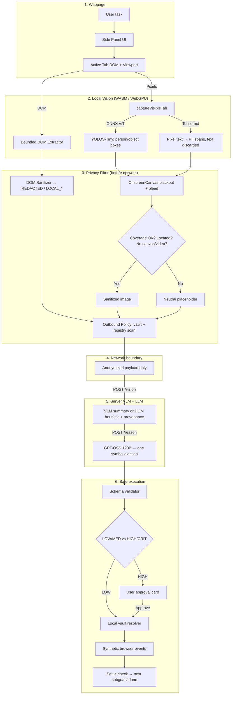

# 🛡️ PrivAgent — Privacy-Preserving Vision Agent for the Browser

[](https://www.sih.gov.in/)
[](https://developer.chrome.com/docs/extensions/mv3/)
[](https://extensionworkshop.com/)
[](#-1-local-vision-processing-client-side)
[](#-2-privacy-preserving-filter-before-any-network-call)
[](#-testing--verification)
[](docs/REUSE_AND_ATTRIBUTION.md)

> **Server sees structure. Never secrets.**
> A local Vision Transformer reads your screen *inside the browser*, redacts faces / passwords / PII on-device, and only then sends anonymized context to a redaction-aware server VLM + LLM that returns safe browser actions.

**Stack:** `Transformers.js + ONNX Runtime Web (WASM SIMD / WebGPU) + Tesseract.js OCR` on client · `FastAPI + open-weights VLM + GPT-OSS 120B` on server · `Manifest V3` on Chrome & Firefox.

---

## 🎯 30-Second Brief for Evaluators

| # | Official metric (100%) | Live check (3 min) | What PrivAgent shows |
|---|---|---|---|
| 1 | **Visual context accuracy — 25%** | Side Panel → run any portal task | Local YOLOS-Tiny + OCR locate people/text regions; server VLM returns `spatial_layout` + `visual_state` prose with provenance (`REAL_VLM` / `DOM_PLUS_HEURISTIC` / `DOM_ONLY`). Controls stay DOM-grounded for precision. |
| 2 | **PII recall & precision — 20%** | Open `/government-aadhaar.html`, `/page-b-sensitive-form.html` | DOM signals (`type=password`, `autocomplete`, aria) × pixel OCR × checksum-verified registry: Aadhaar, PAN, cards, SSN/SIN/NIN/NHS/IBAN, IFSC, email, phone, DOB, OTP/password. |
| 3 | **Redaction precision — 20%** | Same pages | `OffscreenCanvas` solid blackout + 3px bleed + `[REDACTED_*]` labels; fail-closed placeholder when coverage is uncertain; OCR text never leaves device. |
| 4 | **Client resource use — 20%** | Side Panel → Settings → Developer diagnostics | Quantized `model_q4.onnx` (~7.5 MB), bundled WASM + lang data, **0 bytes** runtime download; `heap` / `asset_bytes` / per-stage timings exported. |
| 5 | **End-to-end latency — 15%** | Side Panel diagnostics per step | Detection + OCR run concurrently; one symbolic action per planning call; provider failover to DOM heuristic. Per-stage timings visible live. |

**3-minute demo:** `python3 test-server/app.py` → load `dist/chrome/` → open `/government-aadhaar.html` → type *"Fill this form with my saved profile"* → watch PII blacked out locally → approve submit on confirmation card → done. Vault values are resolved locally at execution time only.

---

## 📌 Problem Statement → Our Answer

**Background (summary):** Agentic AI needs screen context, but server-side pipelines force users to share sensitive pixels. A local browser agent with lightweight on-device vision (WebGPU/WASM + ONNX/Transformers.js) can keep secrets local and send only structure to the cloud for reasoning.

**What was asked:** Build a browser vision agent where a local ViT reads the screen, sanitizes PII *before any network request* (DOM tags or any method), dynamically redacts faces/passwords/PII, transmits only anonymized data to a redaction-aware server, which returns executable commands. Balance latency vs. accuracy.

**Expected prototype = extension + server:**

| Expected component | PrivAgent implementation | Code |
|---|---|---|
| **Client: Local Vision Processing (WebGPU)** | Packaged **YOLOS-Tiny ViT** (pinned `Xenova/yolos-tiny`) on ONNX Runtime Web (WASM SIMD, WebGPU where available) + **Tesseract.js OCR**, run in parallel in the side panel | `extension/perception/local-vision.js`, `extension/runtime/model-runtime.js` |
| **Client: Privacy-Preserving Filter (bbox redaction / masking)** | **Dual engine:** DOM Sanitizer (values → `[REDACTED]` / `LOCAL_*`) + Screenshot Sanitizer (pixels → blackout). Outbound Policy Engine blocks any raw leak | `extension/privacy/dom-sanitizer.js`, `extension/privacy/screenshot-sanitizer.js`, `extension/privacy/policy-engine.js` |
| **Server: Anonymized context → LLM/VLM → UI action** | `POST /vision` (layout summary) → `POST /reason` (one symbolic action: `CLICK`/`TYPE`/`SUBMIT`/`SCROLL`…) → local validate → risk-gate → vault-resolve → synthetic browser event | `backend/server.py`, `backend/vlm_service.py`, `backend/gpt_oss_service.py`, `extension/executor/`, `extension/content/content.js` |
| **Open-weights model (cloud allowed in SIH)** | Reasoning `gpt-oss-120b` (OpenAI-compatible); Vision rotatable OpenRouter / HF / Groq; Bedrock supported | `backend/config.py`, `docs/model-providers.md` |
| **End-to-end assistive task** | 15-state task lifecycle + 10-state enforced step FSM + 11 local benchmark portals + human-in-the-loop approvals | `extension/shared/constants.js`, `extension/agent/state-machine.js`, `extension/background/agent-controller.js`, `test-server/app.py` |
| **Chrome + Firefox** | MV3 Side Panel (Chrome) + MV3 Sidebar (Firefox), one-command builds | `extension/manifest.json`, `extension/manifest.firefox.json`, `scripts/package-extension.mjs` |

✅ **Coverage verdict:** every line of the Expected Solution is implemented and demonstrable. See [Evaluation Scorecard](#-evaluation-scorecard--how-to-verify-each-metric) for exactly where judges should click.

---

## ✨ Why This Wins — 5 Things Judges Remember

1. **Real on-device ViT, not a mock.** Quantized detection + OCR actually run in the extension. Disconnect the network and redaction still works.
2. **Fail-closed by design.** No box? No coverage? Canvas/video surface? → neutral `Screenshot withheld (N masked regions)` placeholder goes out, never raw pixels.
3. **Checksums kill false positives.** Luhn / Mod-11 / Mod-97 + proximity gating lets order IDs and travel dates stay useful while real IDs get masked.
4. **Server knows about the masks.** Redaction counts travel with the payload; VLM prompt says *"Black regions are privacy masks: do not infer or reconstruct"*; fabricated PII in VLM output is discarded + provider rotated.
5. **Secrets never cross the wire.** Cloud sees only `LOCAL_AADHAAR`, `LOCAL_PASSWORD`, etc. Plaintext is swapped in from `chrome.storage.local` at the last millisecond, inside the browser.

---

## 🏗️ How It Works



<details>
<summary>📋 Text version</summary>

```
[ PAGE ] → [ DOM extractor ] → [ DOM sanitizer → LOCAL_* ]
    ↓
[ Viewport pixels ] → [ YOLOS-Tiny + Tesseract ] → [ boxes ]
    ↓
[ Screenshot sanitizer: blackout, or placeholder if uncertain ]
    ↓
[ Outbound policy blocks raw leaks ] → [ backend ]
    ↓
[ VLM prose or DOM heuristic ] → [ GPT-OSS planner: 1 action ]
    ↓
[ Validator → Risk gate → (approval) → Vault resolver → Executor ]
```

</details>

### 🤖 Agent State Machines

Two layers guard every step.

**1. Task lifecycle — 15 states** (`extension/shared/constants.js:5`, `AgentState`). This is what the Side Panel displays via `STATE_CHANGED`:

`IDLE → UNDERSTANDING_TASK → OBSERVING → SANITIZING → VISUAL_ANALYSIS → REASONING → PLANNING → VALIDATING_ACTION → EXECUTING (or WAITING_FOR_USER) → VERIFYING → OBSERVING … → COMPLETED / FAILED / CANCELLED`, plus `PAUSED` for a user-held task.

**2. Enforced per-step FSM — 10 states** (`extension/agent/state-machine.js:9`, `AgentLoopState`). `AgentLoopStateMachine` rejects illegal edges, forces every step to begin in `OBSERVE`, and binds one `observationId` per step so an action planned against a stale observation throws instead of executing:

`OBSERVE → UNDERSTAND → GROUND → PLAN → VALIDATE → EXECUTE → VERIFY → REPLAN → (OBSERVE | PLAN | DONE)`, with `BLOCKED` reachable from every non-terminal state and `DONE` terminal.

Both are driven by `extension/background/agent-controller.js`. Loops stop on `maxSteps` (default 25) or after 3 consecutive failures. Every step records per-stage timings for the latency metric.

---

## 🖥️ 1. Local Vision Processing (Client-Side)

- `extension/perception/local-vision.js` — loads pinned `model_q4.onnx`, runs detection + OCR concurrently. Returns `people`, `piiRegions`, `safeToTransmitAfterRedaction`, `backend` (wasm/webgpu), `modelLoadMs` / `inferenceMs` / `totalMs`, heap + asset bytes.
- `extension/runtime/model-runtime.js` — packaged ONNX loader, no CDN at runtime; WebGPU-first with WASM fallback.
- `extension/perception/screenshot.js` — viewport capture; `observation-fusion.js` — fuses sanitized DOM + VLM prose; `provenance.js` — labels `REAL_VLM` / `DOM_PLUS_HEURISTIC` / `DOM_ONLY` so judges know what they are looking at.
- `extension/perception/ocr/local-ocr.js` — shared packaged Tesseract worker for page perception *and* the PDF tool; OCR text returns only to the extension page and is never logged or forwarded to the backend.
- `extension/perception/page-state-modeler.js` — compact, task-conditioned page view so the reasoner gets relevant evidence, not a DOM dump.
- `extension/perception/task-grounding.js` — binds the user's natural-language request to real page evidence *before* the remote model plans.
- `extension/perception/semantic-capability.js` — normalizes each actionable element from general browser semantics only (a11y metadata, role/type, control relationships, visible text, state). No site-specific rules.
- `extension/perception/perception-provider.js` — selects the local-perception provider and reports which signals are actually available.
- `extension/perception/pdf-table-extractor.js` — local PDF table extraction with no backend, network, storage, or logging calls. See [PDF to Google Sheets](#pdf-to-google-sheets-on-device).

## 🔒 2. Privacy-Preserving Filter (Before Any Network Call)

- `extension/privacy/screenshot-sanitizer.js` — solid `#000000` boxes + `[REDACTED TYPE]` label; withholds placeholder on any doubt (unlocated text, missing coverage, opaque canvas/video).
- `extension/privacy/dom-sanitizer.js` — values → `[REDACTED]` + `LOCAL_*`; scrubs placeholders, labels, URLs, options, headings, visible text.
- `extension/privacy/pii-rules.js` — **single shared registry** used by DOM + OCR + policy engine alike, with proximity gating (±60 chars) and checksum validators.
- `extension/privacy/pii-detector.js` — deterministic/contextual detector over that registry; adds Verhoeff checksum validation for Aadhaar.
- `extension/privacy/policy-engine.js` + `secret-detector.js` — final outbound scan over vault exact-matches + registry; throws `OutboundPolicyViolationError` instead of sending.
- `extension/privacy/local-vault.js` + `vault-crypto.js` — the vault. One non-extractable AES-GCM-256 `CryptoKey` is generated once and persisted in `chrome.storage.local`; every value is sealed under its own random IV, and GCM authentication failure surfaces as a decrypt error rather than silent plaintext. Backend tokens use the same envelope.
- `extension/content/content.js` — bounded 120-element Shadow-DOM-aware extractor, synthetic-event executor, stability observer.
- `extension/navigation/navigation.js` — pure capability-aware navigation helpers (no `chrome.*` dependency) shared by the controller and the executor.
- `extension/agent/verifier/action-verifier.js` — settle check that decides next subgoal vs. done after execution.

## ☁️ 3. Server-Side Integration (Redaction-Aware)

- `backend/server.py` — `POST /vision`, `POST /reason`, `POST /interpret`, `GET /health`; extension-origin regex + shared-secret + rate-limit + 5 MB cap.
- `backend/vlm_service.py` — rotates OpenRouter → HF → Groq (4s timeout), rejects provider error-text-as-content, drops fabricated PII, falls back to DOM heuristic; always reports provenance.
- `backend/gpt_oss_service.py` + `backend/agentic/prompts.py` — plan + grounding + critique in one call per action; symbolic actions only; hallucinated IDs/values repaired to `WAIT` + re-observe.
- `backend/agentic/orchestrator.py` — composes the single fused Planner + Critique call per step. The loop itself lives in the extension, which owns tabs, confirmations, and the vault. `context.py` compacts the request to a 12K-char budget (short history + relevant observation + current request) after providers rejected oversized payloads with HTTP 413; `schemas.py` holds the structured plan/critique models.
- `backend/agentic/_upstream/` + `VENDORING.md` — byte-identical reference copies of the four pinned TheAgenticBrowser Python files, with SHA-256 checksums and the required license notice. Reference-only; not on the live request path.
- `backend/privacy_rules.py` — defense-in-depth: server re-rejects any unredacted pattern that slipped through.
- Config: `backend/config.py`, providers: `docs/model-providers.md`, vendoring record: `backend/agentic/VENDORING.md`.

---

## 📊 Evaluation Scorecard — How to Verify Each Metric

| Metric | Weight | Live verification |
|---|---|---|
| **1. Visual context** | 25% | Run a task on `/page-c-visual-ui.html`: Side Panel shows VLM `spatial_layout` + `visual_state` with `model_trace` (provider/model). DOM controls remain grounded by element ID. Optional IoU: `npm run evaluate:vision -- annotations.jsonl --iou 0.5` (needs human-labeled JSONL). |
| **2. PII recall/precision** | 20% | Open `/government-aadhaar.html` + `/page-b-sensitive-form.html`: Aadhaar/PAN/cards/OTP blacked out in pixels and `LOCAL_*` in DOM. Unit proof: `npm run test:privacy`. |
| **3. Redaction precision** | 20% | Same pages: every sensitive box is opaque black + labeled; uncertain pages send placeholder (check `screenshotStatus: withheld/masked/checked` in transparency panel). E2E proof: `python3 tests/e2e_master_hardening_suite.py`. |
| **4. Client resources** | 20% | Diagnostics show `model_q4.onnx` (~7.5 MB quantized), `client_heap_bytes`, `client_asset_bytes`, `backend: wasm/webgpu`. `dist/` builds ~48 MB unpacked each (of which ~37 MB is the bundled `vendor/` runtime: ONNX Runtime Web 28 MB, PDF.js 4.4 MB, Tesseract 3.9 MB), 0-byte runtime fetch. |
| **5. Latency** | 15% | Diagnostics show `dom_capture_ms`, `local_vision_ms`, `screenshot_redaction_ms`, `vlm_request_ms`, `reasoning_request_ms` per step. Detection + OCR overlap; one action per call keeps planning bounded. |

Full privacy matrix:

| Category | Detector | Check | Token sent to server |
|---|---|---|---|
| Aadhaar | 12-digit UIDAI regex (leading `[2-9]`) | **Verhoeff checksum** boosts confidence 0.85 → 0.99 | `LOCAL_AADHAAR` |
| PAN | `[A-Z]{5}[0-9]{4}[A-Z]` | format | `LOCAL_PAN` |
| Cards | 13–19 digits | **Luhn Mod-10** | `LOCAL_CREDIT_CARD` |
| SSN / SIN / NIN / NHS / IBAN / IFSC | region regexes | area / Luhn / Mod-11 / Mod-97 / format | `LOCAL_SSN` etc. |
| Email / Phone / DOB / OTP / Password / CVV | patterns + labels | regex / proximity / date-range | `LOCAL_EMAIL` etc. |
| Faces & people | YOLOS-Tiny | conf ≥ 0.35 | full-box blackout |
| Vault secrets | exact match | whole-token | `LOCAL_CUSTOM_*` |

---

## 🎬 End-to-End Demo (Run This)

1. `python3 test-server/app.py` → `http://localhost:5000/government-aadhaar.html`
2. Load `dist/chrome/` (Chrome) or `dist/firefox/` (Firefox) — see Quickstart.
3. Save a dummy profile in the vault; type *"Fill this Aadhaar form with my profile and submit"*.
4. Watch: faces/PII blacked out on the screenshot preview, DOM values become `LOCAL_*`, the planner emits one grounded action at a time, local values resolve in the browser, and form submission waits for its own approval card.
5. Bonus: `/flight-search.html` (cheapest-pick), `/prompt-injection.html` (injection quarantined), `/document-upload.html` (attach a named vault document after the HIGH-risk confirmation, or choose a file in the page picker).

All 11 portals live in `test-server/pages/`. Full hardening scenarios in `tests/e2e_master_hardening_suite.py`.

Values from older vault versions remain encrypted and are still checked by local privacy protection, but stay unavailable to the agent until you review and save them in the Local Vault.

---

## ⚖️ Latency vs. Accuracy — Our Balance

- **Keep private perception local:** page detection + OCR support masking; OCR text is discarded locally, only boxes + counts travel. The separate PDF tool keeps rows in the panel only for preview and user-requested export.
- **Preserve source information:** VLM summary, DOM heuristic, and DOM-only fallback are labeled separately — planner never confuses them.
- **Keep planning bounded:** compact `page_evidence`, one action per call, `ALLOWED_ELEMENT_IDS` as grounding authority; grounding-repair downgrades hallucinations to `WAIT`.

## PDF to Google Sheets (on-device)

Open the side panel's **PDF to Google Sheets** card, choose a PDF, and select **Extract table**. Searchable text is parsed with the packaged PDF.js runtime; pages without selectable text use the already packaged English Tesseract OCR. Review the preview, then copy rows and paste them into the first cell in Google Sheets, or download a CSV and use Sheets' **File → Import**.

The PDF and extracted rows stay in side-panel memory; they are not sent to the agent, model providers, or backend. PrivAgent has no Google Sheets API/OAuth integration, so the final paste/import is user initiated. Column boundaries are inferred from PDF text positions (or local OCR word positions), so review the preview before using the data. PDF processing is limited to 20 MB and the first 40 pages.

## 🚀 5-Minute Quickstart

```bash
cp .env.example .env

# In .env, set at minimum:
#   BACKEND_SHARED_SECRET=<random 32+ byte value>   REQUIRED by /vision, /reason, /interpret
#   AI_BASE_URL + AI_API_KEY + REASONING_MODEL      reasoning engine
#   OPENROUTER_API_KEYS / HUGGINGFACE_API_KEYS / GROQ_API_KEYS   VLM rotation (comma-separated lists)
# Generate the secret with:
python3 -c "import secrets; print(secrets.token_urlsafe(32))"

npm install && npm run prepare:local-vision-assets   # SHA-checks model_q4.onnx, bundles vendor/
npm run build:extensions    # → dist/chrome/ + dist/firefox/
python3 -m uvicorn server:app --app-dir backend --port 8000   # curl 127.0.0.1:8000/health
python3 test-server/app.py  # :5000 benchmark portals
# Chrome: chrome://extensions → Load unpacked → dist/chrome/
#   then Side Panel → Settings → Backend URL http://localhost:8000 + paste BACKEND_SHARED_SECRET
# Firefox: about:debugging → Load Temporary Add-on → dist/firefox/manifest.json
python3 launch_test_browser.py /government-aadhaar.html   # optional auto-launcher
```

**The backend token step is mandatory, not optional.** `/vision`, `/reason`, and `/interpret` reject requests without `BACKEND_SHARED_SECRET`, and the extension must present the same value in Settings → backend token. A demo with no token fails at the first request even though `/health` returns 200.

VLM keys are optional as a group but at least one provider must be reachable or `/vision` falls back to the DOM heuristic (provenance `DOM_PLUS_HEURISTIC` / `DOM_ONLY`). Bedrock is an alternative to the `AI_BASE_URL` path — see `.env.example`.

`dist/` is the loadable build (`extension/` is source — `package-extension.mjs` copies, strips tests, validates parsers/secrets/size).

## 🧪 Testing & Verification

```bash
npm test                    # 566 tests across 42 JS files
npm run test:privacy        # sanitization, vault, PII, policy
npm run test:executor       # validator, risk gate, resolver
npm run test:reasoning      # understanding, forms, prompts
npm run test:perception     # fusion, grounding, state model
npm run test:agent          # FSM, circuit breakers
npm run test:navigation     # capability-aware navigation helpers
npm run test:grounding      # task grounding, semantic capability
npm run test:schemas        # IPC contracts
npm run test:all            # every JS suite, quoted globs
python3 -m unittest discover -s tests/security -p 'test_*.py'  # 73 backend security tests
python3 tests/e2e_master_hardening_suite.py                     # Playwright hardening suite
python3 tests/e2e_full_suite.py                                  # broader Playwright E2E
python3 tests/privacy_and_latency_suite.py                       # redaction + timing
npm run evaluate:vision -- annotations.jsonl --iou 0.5          # needs human-labeled JSONL
npm run evaluate:agent && npm run evaluate:task-runs            # agent / task-run reports
python3 tests/visual_qa_sidepanel.py                            # side panel visual QA
```

`npm test` globs `tests/**/*.test.js` unquoted; `npm run test:all` quotes the globs so Node expands them itself and is the more portable entry point on shells that do not glob `**`.

Logs are JSONL and redacted: `backend/logs/backend.jsonl` (rotating, 8 MiB × 5) + Side Panel *Settings → Developer → Download error log*. Packaging fails on version mismatch, shipped tests, leaked keys, unparsable scripts, or oversize bundles.

## 🎯 Benchmark Portals (`:5000`)

| Portal | URL | What it proves |
|---|---|---|
| Aadhaar Citizen | `/government-aadhaar.html` | Aadhaar/PAN blackout + symbolic resolve + submit gate |
| Flight Comparison | `/flight-search.html` | multi-step search + DOM-grounded result-card + cheapest pick |
| Doc Upload | `/document-upload.html`, `/page-d-document-upload.html` | named vault files attach only after HIGH-risk approval; other files use the page picker |
| Adversarial | `/prompt-injection.html`, `/page-e-prompt-injection.html` | injection variants quarantined |
| Normal / Sensitive forms | `/page-a-normal-form.html`, `/page-b-sensitive-form.html` | baseline speed vs strict PII handling |
| Visual UI | `/page-c-visual-ui.html` | VLM prose supplements DOM-grounded controls |
| Complex / Contact | `/complex-forms.html`, `/contact-form.html` | React inputs, radios, dropdowns, long text |

## 🛡️ Threat Model & Honest Limits

- **Untrusted:** page DOM/text, page IPC (can't approve, touch vault, or change settings).
- **Guarantees:** no unredacted payloads (`OutboundPolicyViolationError`), fail-closed images, high-risk approval cards, symbolic-only secrets to the cloud.
- **Prototype limits:** vault in `chrome.storage.local` (encrypted at rest, no OS keychain or user passphrase); regex heuristics cover standard IDs, not arbitrary secrets; arbitrary file picking stays user-directed while named vault documents require HIGH-risk approval; screenshot-box IoU eval needs human-labeled annotations.

Details: `docs/threat-model.md`, `docs/privacy-model.md`, `docs/architecture.md`, design rationale in `docs/ARCHITECTURE_DECISIONS.md`.

## 📂 Repository Layout

```
extension/
  background/      service worker, agent controller, message router, task manager
  agent/           step state machine + post-action verifier
  content/         bounded extractor, synthetic-event executor, log forwarder
  privacy/         DOM + screenshot sanitizers, PII registry, policy engine, vault + vault crypto
  perception/      local vision, OCR worker, fusion, provenance, grounding, page modeler, PDF extractor
  reasoning/       understanding, form reasoning, prompts
  executor/        validator, risk gate, local value resolver, action executor
  navigation/      capability-aware navigation helpers
  runtime/         packaged-model runtime boundary
  shared/          constants, schemas, message contracts, logger
  sidepanel/       Side Panel UI (app.js, index.html, styles.css)
  models/          generated: pinned model_q4.onnx + lang data (do not hand-edit)
  vendor/          generated: ONNX Runtime Web, PDF.js, Tesseract, transformers
  manifest.json, manifest.firefox.json
dist/chrome|firefox  Loadable builds (generated — load these, not extension/)
backend/
  server.py, config.py, privacy_rules.py, logging_config.py
  vlm_service.py, gpt_oss_service.py
  agentic/         fused Planner+Critique call, prompts, schemas, compacted context
    _upstream/     byte-identical pinned TheAgenticBrowser reference copies
test-server/       :5000 benchmark portals (11 pages)
tests/
  privacy/ executor/ reasoning/ perception/ agent/ navigation/ grounding/ shared/ content/
  security/        Python backend security tests (73)
  e2e_master_hardening_suite.py, e2e_full_suite.py, privacy_and_latency_suite.py,
  visual_qa_sidepanel.py, e2e_support.py, qa_screenshots/
scripts/           prepare-local-vision-assets.mjs, package-extension.mjs,
                  evaluate_{vision,agent_models,task_runs}.py, launch_test_browser.py
                  (note: two launchers — the root launch_test_browser.py opens a benchmark
                   portal; scripts/launch_test_browser.py opens a general web page)
docs/
  architecture.md, privacy-model.md, threat-model.md, model-providers.md
  ARCHITECTURE_DECISIONS.md, architecture-audit-runanywhere.md, agent-model-evaluation.md
  REUSE_AND_ATTRIBUTION.md
```

## 📜 Attribution

Audited sources, patterns, and clean-room implementations are detailed in `docs/REUSE_AND_ATTRIBUTION.md`.

- **Magnitude Browser Agent** (Apache-2.0) — `Observe→Act→Verify` cycle, minimal a11y tree, stability detection. Clean-room reimplementation.
- **AI Browser Agent** (MIT) — intent parsing and progress reporting. Clean-room reimplementation.
- **TheAgenticBrowser** (TheAgentic Community License 1.0, pinned commit `71daa28`) — Planner plan/next-step structure, Critique feedback/termination structure, and the Planner → executor → Critique workflow, adapted in `backend/agentic/`. Upstream copies are vendored reference-only under `backend/agentic/_upstream/`; hashes and the required license notice are in `backend/agentic/VENDORING.md`. **That license is not Apache-2.0/MIT:** it restricts Excluded Purposes (competing SaaS/PaaS/IaaS) and grants no sublicensing right, so every recipient must agree to its terms directly.
- **RunAnywhere on-device browser agent** (Apache-2.0) — studied as a reference; no code, assets, or models taken. Only the WebGPU-with-WASM-fallback execution idea was adopted, reusing the already-packaged `jsep` runtime.
- **Packaged third-party assets:** `transformers` (Apache-2.0), `onnxruntime-web` (MIT), `yolos-tiny` (see upstream model card), `tesseract.js` + `@tesseract.js-data/eng` (Apache-2.0), PDF.js 4.10.38 (Apache-2.0). `extension/vendor/` and `extension/models/` are generated distributable assets.

Full notices: `docs/REUSE_AND_ATTRIBUTION.md`.
