# 🛡️ PrivAgent: Privacy-Preserving Agentic Browser Extension

[](https://www.sih.gov.in/)
[](https://developer.chrome.com/docs/extensions/mv3/)
[](https://extensionworkshop.com/)
[](#client-side-vision-processing)
[](#privacy-preserving-filter--redaction-engine)
[](#-testing--verification-suite)
[](docs/REUSE_AND_ATTRIBUTION.md)

> **Official Problem Statement Alignment**: A client-side, privacy-preserving browser vision agent built with **Transformers.js**, **ONNX Runtime Web (WASM/WebGPU)**, and **Tesseract.js OCR**, combined with an open-weights/cloud-hosted multimodal reasoning server (**FastAPI + VLM / GPT-OSS 120B**). It dynamically detects and redacts personal identifiers and faces/people on the user's machine *before* any network transmission, passing only anonymized visual context to the central server, and executes actionable browser commands under human-in-the-loop safety gates.

---

## 📋 Problem Statement & Solution Mapping

### The Challenge
> *"Background AI agents are becoming omnipresent... Most of the agentic AI pipelines are deployed on server side which limits the type of data that a user can share with it... Local system generally has fewer resources than server and is unable to host a full-fledged pipeline therefore only the non-sensitive data such as structure of the screen, application fields etc can be sent to server for processing.*
>
> *Participants are required to build a privacy-preserving vision agent which runs on browser. This involves implementing a client-side architecture where a local Vision Transformer (ViT) or equivalent computer vision model 'reads' the user's screen and takes decision based on that. If it requires the visual context to be sent to server, it shall sanitize the sensitive/PII data using DOM tags or any other method, before any network request is made. It should dynamically detect and redact sensitive elements (e.g., blurring faces, blacking out passwords, masking PII). Only this anonymized data should be transmitted to the central server... which returns actionable commands."*

### How PrivAgent Solves It

| Problem Statement Requirement | PrivAgent Architectural Implementation | Reference Implementation |
| :--- | :--- | :--- |
| **Local Vision Processing (Browser-based ViT)** | Packaged **YOLOS-Tiny Vision Transformer** running in ONNX Runtime Web via WebAssembly SIMD (`ort-wasm-simd-threaded.wasm`) + WebGPU support in the extension side panel. | [local-vision.js](file:///home/vishal/D%20drive/new%20agentic%20browser/extension/perception/local-vision.js) |
| **Client-Side Privacy Preserving Filter** | **Dual-engine sanitization**: Local Tesseract OCR identifies textual PII in rendered pixels; DOM Sanitizer scrubs interactive fields; canvas masking applies solid blackouts (`#000000`). | [screenshot-sanitizer.js](file:///home/vishal/D%20drive/new%20agentic%20browser/extension/privacy/screenshot-sanitizer.js), [dom-sanitizer.js](file:///home/vishal/D%20drive/new%20agentic%20browser/extension/privacy/dom-sanitizer.js) |
| **Dynamic Face / Person Masking** | Local YOLOS-Tiny model detects COCO `person` objects; bounding boxes are conservatively masked on canvas before transmission. | [local-vision.js](file:///home/vishal/D%20drive/new%20agentic%20browser/extension/perception/local-vision.js#L11), [screenshot-sanitizer.js](file:///home/vishal/D%20drive/new%20agentic%20browser/extension/privacy/screenshot-sanitizer.js#L93-L125) |
| **Password & PII Redaction** | Blacking out password fields, PINs, OTPs, Aadhaar, PAN, SSN, SIN, NIN, NHS, IBAN, and credit cards (validated via Luhn / Mod-11 / Mod-97 checksums). | [pii-rules.js](file:///home/vishal/D%20drive/new%20agentic%20browser/extension/privacy/pii-rules.js), [secret-detector.js](file:///home/vishal/D%20drive/new%20agentic%20browser/extension/privacy/secret-detector.js) |
| **Fail-Closed Safeguard** | If local vision fails, sensitive OCR has no box, or Canvas/Video surfaces exist, screenshots are withheld as neutral placeholders. | [screenshot-sanitizer.js](file:///home/vishal/D%20drive/new%20agentic%20browser/extension/privacy/screenshot-sanitizer.js#L24-L46) |
| **Server Side Integration (VLM/LLM)** | FastAPI backend consumes sanitized screenshot + sanitized DOM, returning visual grounding and actionable step plans. | [server.py](file:///home/vishal/D%20drive/new%20agentic%20browser/backend/server.py), [vlm_service.py](file:///home/vishal/D%20drive/new%20agentic%20browser/backend/vlm_service.py) |
| **Actionable UI Commands Execution** | Symbolic actions (`CLICK`, `TYPE`, `SELECT`, `SCROLL`, `SUBMIT`) executed in page via synthetic browser events; secrets resolved locally from vault. | [browser-executor.js](file:///home/vishal/D%20drive/new%20agentic%20browser/extension/content/browser-executor.js), [local-value-resolver.js](file:///home/vishal/D%20drive/new%20agentic%20browser/extension/executor/local-value-resolver.js) |
| **Cross-Browser Support** | Clean automated builds for both **Google Chrome** (MV3 Side Panel) and **Mozilla Firefox** (MV3 Sidebar Action). | [package-extension.mjs](file:///home/vishal/D%20drive/new%20agentic%20browser/scripts/package-extension.mjs) |

---

## 📊 Evaluation Metrics Scorecard (100%)

The solution is specifically structured and benchmarked against the 5 official competition criteria:

```
┌────────────────────────────────────────────────────────────────────────────────────────┐
│                        COMPETITION EVALUATION METRICS BREAKDOWN                        │
├─────────────────────────────────────────────────┬───────────┬──────────────────────────┤
│ Metric                                          │ Weightage │ PrivAgent Implementation │
├─────────────────────────────────────────────────┼───────────┼──────────────────────────┤
│ 1. Accuracy of visual context from screen       │    25%    │ IoU Fusion + Server VLM  │
│ 2. Recall and precision for detection of PII    │    20%    │ Shared PII Registry + OCR│
│ 3. Precision of redaction                       │    20%    │ OffscreenCanvas Blackout │
│ 4. Client side resource utilization             │    20%    │ Quantized Q4 ONNX + Heap │
│ 5. Overall end-to-end latency of task           │    15%    │ Parallelized Local Vision│
└─────────────────────────────────────────────────┴───────────┴──────────────────────────┘
```

### 1. Accuracy of Visual Context from Screen (25%)
- **Observation Fusion**: [ObservationFusion](file:///home/vishal/D%20drive/new%20agentic%20browser/extension/perception/observation-fusion.js#L31-L214) computes spatial Intersection-over-Union ([calculateIoU](file:///home/vishal/D%20drive/new%20agentic%20browser/extension/perception/observation-fusion.js#L9-L29)) between DOM bounding boxes and visual detections, linking semantic accessibility roles with physical viewport pixels.
- **Visual Grounding Provenance**: Every observation reports its provenance: `DOM_PLUS_REAL_VLM` (multimodal vision inference), `DOM_PLUS_HEURISTIC` (DOM layout fallback), or `DOM_ONLY` (fail-closed).
- **Evaluator**: Scored using `--iou 0.5` bounding box matching in [scripts/evaluate_vision.py](file:///home/vishal/D%20drive/new%20agentic%20browser/scripts/evaluate_vision.py#L34-L55).

### 2. Recall & Precision for Detection of Sensitive/PII Data (20%)
- **Multi-Modal Detection**: Combines structural DOM inspection (`input[type="password"]`, `autocomplete`, aria labels) with local Tesseract.js OCR scanning page pixels.
- **Rule Verification**: Integrates checksum algorithms to eliminate false positives:
  - **Luhn Algorithm (Mod-10)**: Payment cards and Canadian SINs ([validateLuhnDigits](file:///home/vishal/D%20drive/new%20agentic%20browser/extension/privacy/pii-rules.js#L10-L22)).
  - **Mod-11 Algorithm**: UK NHS numbers ([validateNhsNumber](file:///home/vishal/D%20drive/new%20agentic%20browser/extension/privacy/pii-rules.js#L24-L31)).
  - **Mod-97 Algorithm**: International Bank Account Numbers ([validateIban](file:///home/vishal/D%20drive/new%20agentic%20browser/extension/privacy/pii-rules.js#L33-L43)).
  - **Context-Proximity Gating**: Indian mobile numbers and DOBs require proximity keywords to prevent false positives on product serials.

### 3. Precision of Redaction (20%)
- **Pixel-Accurate Masking**: [ScreenshotSanitizer](file:///home/vishal/D%20drive/new%20agentic%20browser/extension/privacy/screenshot-sanitizer.js#L93-L125) renders solid `#000000` blackout rectangles over DOM and OCR bounding boxes with a 3px bleed padding on an `OffscreenCanvas`.
- **Zero Plaintext Transmission**: OCR text is processed in transient memory variables and discarded immediately after bounding box extraction.
- **Fail-Closed Withholding**: Replaces unlocatable PII or canvas surfaces with a neutral placeholder image: `Screenshot withheld (N masked regions)`.

### 4. Client-Side Resource Utilization (20%)
- **Quantized 4-Bit ONNX Weights**: Pinned `Xenova/yolos-tiny` model packaged as `model_q4.onnx` (~28 MB) with SHA-256 integrity verification (`a3e0b7d8...`).
- **No External Network Bloat**: All WASM binaries (`ort-wasm-simd-threaded.wasm`, `tesseract-core-simd-lstm.wasm`) and trained OCR models are bundled in `extension/vendor/` and `extension/models/`. Runtime network downloads are **0 bytes**.
- **Heap & Asset Telemetry**: Telemetry exports track `client_heap_bytes` and `client_asset_bytes` via [downloadVisionEvaluation](file:///home/vishal/D%20drive/new%20agentic%20browser/extension/sidepanel/app.js#L1069-L1091).

### 5. Overall End-to-End Latency of the Provided Task (15%)
- **Optimized Local Pipeline**: Object detection and OCR run concurrently in the extension side panel.
- **Provider Rotation & Timeout Caps**: Server VLM rotates across OpenRouter, Hugging Face, and Groq with a 4.0-second timeout; if unfulfilled, it falls back instantly to the local DOM heuristic.
- **Batched Form Planning**: [FormPlanBuilder](file:///home/vishal/D%20drive/new%20agentic%20browser/extension/reasoning/form-plan-builder.js) batches multi-input form entries into a single `FILL_FORM_PLAN` execution, reducing model roundtrips from $N$ steps to 1 step.

---

## 💡 System Architecture & End-to-End Pipeline Flowchart

The following interactive flowchart illustrates the full client-server lifecycle, specifically mapping to the Problem Statement requirements: local Vision Transformer (ViT) screen reading, dynamic face and PII redaction on client canvas, anonymized transmission across the security boundary, server-side multimodal VLM/LLM reasoning, and human-gated browser action execution.

```mermaid
flowchart TD
    %% Styling Definitions
    classDef client fill:#1e1b4b,stroke:#6366f1,stroke-width:2px,color:#ffffff;
    classDef privacy fill:#064e3b,stroke:#10b981,stroke-width:2px,color:#ffffff;
    classDef server fill:#312e81,stroke:#818cf8,stroke-width:2px,color:#ffffff;
    classDef gate fill:#701a75,stroke:#f472b6,stroke-width:2px,color:#ffffff;
    classDef boundary fill:#18181b,stroke:#71717a,stroke-width:1px,stroke-dasharray: 5 5,color:#e4e4e7;
    classDef action fill:#451a03,stroke:#f59e0b,stroke-width:2px,color:#ffffff;

    subgraph CLIENT["🖥️ CLIENT-SIDE ENVIRONMENT (Browser Extension / Local Machine)"]
        direction TB

        subgraph BROWSER["🌐 Browser Context & Untrusted Webpage"]
            USER(["👤 User Task / Prompt"]):::client
            PAGE["📄 Active Tab Webpage (DOM & Viewport)"]:::client
            USER -->|Initiate Task| SP_UI["Side Panel Interface"]:::client
            SP_UI -->|Trigger Observation| PAGE
        end

        subgraph LOCAL_PERCEPTION["👁️ Local Vision Processing (Client ViT & OCR via WebGPU/WASM)"]
            DOM_EXTRACT["Bounded DOM Extractor\n(Accessibility Tree, Inputs, Labels & Roles)"]:::client
            SCREEN_CAP["Visible Tab Screenshot\n(chrome.tabs.captureVisibleTab)"]:::client
            
            PAGE -->|Extract Structure| DOM_EXTRACT
            PAGE -->|Capture Pixels| SCREEN_CAP

            LOCAL_VIT["Local Vision Transformer (ViT)\n(Quantized YOLOS-Tiny via ONNX Runtime Web / WebGPU)"]:::privacy
            LOCAL_OCR["Local OCR Engine\n(Tesseract.js WASM)"]:::privacy

            SCREEN_CAP -->|In-Browser ViT Inference| LOCAL_VIT
            SCREEN_CAP -->|In-Memory Text Scan| LOCAL_OCR
            
            LOCAL_VIT -->|Detects Person / Object Boxes| MERGE_BOXES["Coordinate & Bounding Box Aggregator"]:::privacy
            LOCAL_OCR -->|Matches PII Patterns & Discards Raw Text| MERGE_BOXES
        end

        subgraph PRIVACY_ENGINE["🛡️ Privacy-Preserving Filter & Dynamic Redaction Engine"]
            DOM_SANITIZER["DOM Sanitizer\n(Substitutes Sensitive Values with [REDACTED] & LOCAL_*)"]:::privacy
            DOM_EXTRACT --> DOM_SANITIZER

            CANVAS_MASK["OffscreenCanvas Masking\n(Solid #000000 Blackout Over Face & PII Boxes)"]:::privacy
            MERGE_BOXES --> CANVAS_MASK
            SCREEN_CAP -.->|Viewport Pixels| CANVAS_MASK

            FAIL_CLOSED{"Fail-Closed Safeguard\n(Coverage uncertain, OCR unlocated,\nor Canvas/Video surface?)"}:::privacy
            CANVAS_MASK --> FAIL_CLOSED
            FAIL_CLOSED -->|Yes / Anomaly| PLACEHOLDER["Withhold Screenshot\n(Substitute Neutral Placeholder)"]:::privacy
            FAIL_CLOSED -->|No / Complete| SANITIZED_IMG["Sanitized Image (Masked Faces & PII)"]:::privacy

            POLICY["Outbound Policy Engine\n(Deep Scan vs Vault & Registered Patterns)"]:::privacy
            DOM_SANITIZER -->|Sanitized DOM| POLICY
            SANITIZED_IMG --> POLICY
            PLACEHOLDER --> POLICY
        end

        subgraph EXECUTOR["⚡ Safety Gate & In-Browser Action Execution"]
            VALIDATOR["Action Schema Validator\n(Rejects script / eval injections)"]:::action
            RISK_GATE{"Two-Tier Risk Gate\n(LOW, MEDIUM, HIGH, CRITICAL)"}:::gate
            
            CONFIRM_CARD["Human-in-the-Loop Confirmation\n(Transparent Card in Side Panel)"]:::gate
            
            RESOLVER["Local Value Resolver\n(Swaps Symbolic Tokens with Vault Plaintext)"]:::privacy
            VAULT[("🔒 Local Secret Vault\nchrome.storage.local")]:::privacy
            VAULT -.->|Read Plaintext In-Browser| RESOLVER

            DISPATCHER["Browser Executor\n(Dispatches Synthetic Events: Click, Type, Select)"]:::action
            VERIFY["Observation Verifier\n(Checks DOM Settling & Navigation Success)"]:::client

            VALIDATOR --> RISK_GATE
            RISK_GATE -->|High/Critical: Submit, Checkout, Delete| CONFIRM_CARD
            RISK_GATE -->|Low/Medium: Click, Type, Scroll| RESOLVER
            CONFIRM_CARD -->|User Approved| RESOLVER
            CONFIRM_CARD -->|User Cancelled| CANCEL_HALT(["Halt / Cancel Task"]):::gate

            RESOLVER -->|Injects Value directly into DOM| DISPATCHER
            DISPATCHER -->|Mutates Webpage| PAGE
            DISPATCHER --> VERIFY
            VERIFY -->|Subgoals Remain| PAGE
            VERIFY -->|Goal Satisfied| COMPLETE(["Task Completed"]):::client
        end
    end

    subgraph NETWORK["🔒 ENFORCED NETWORK BOUNDARY (Loopback + Origin Regex)"]
        direction TB
        BOUNDARY_GUARD["Origin-Protected Gateway\n(Verifies Extension Origin Regex; Loopback 127.0.0.1)"]:::boundary
        ANONYMIZED_PAYLOAD["Anonymized Context Payload\n• Sanitized Screenshot (Masked Faces & PII / Withheld)\n• Sanitized DOM (Roles, IDs, Quarantined Text)\n• Zero Raw Secrets or Plaintext Identifiers"]:::boundary
    end

    subgraph SERVER["☁️ SERVER-SIDE INTEGRATION (Centralized LLM / VLM API Cluster)"]
        direction TB
        
        API_GATEWAY["FastAPI Backend Server\n(POST /vision, POST /reason)"]:::server
        
        subgraph VLM_PIPELINE["VLM Visual Perception Cluster"]
            VLM_ROTATOR["Provider Rotator & Timeout Gate\n(OpenRouter ➔ Hugging Face ➔ Groq)"]:::server
            VLM_INFERENCE["Remote Multimodal VLM\n(Interprets Visual Hierarchy & Layout Context)"]:::server
            DOM_HEURISTIC["DOM-Derived Layout Heuristic\n(Automatic Offline Fallback)"]:::server
            
            VLM_ROTATOR -->|Online (<4s)| VLM_INFERENCE
            VLM_ROTATOR -->|Timeout / 429 Error| DOM_HEURISTIC
        end

        OBS_FUSION["Observation Fusion Engine\n(Calculates Spatial IoU between DOM & Visual Boxes)"]:::server
        
        REASONING["Multimodal Reasoning Engine\n(GPT-OSS 120B / Open-Weights VLM)"]:::server

        PROVENANCE["Explicit Provenance Reporter\n(DOM_PLUS_REAL_VLM | DOM_PLUS_HEURISTIC | DOM_ONLY)"]:::server

        ACTION_GEN["Actionable Command Planner\n(Emits Symbolic Actions: CLICK, TYPE value_source: LOCAL_*)"]:::server

        API_GATEWAY --> VLM_ROTATOR
        VLM_INFERENCE --> PROVENANCE
        DOM_HEURISTIC --> PROVENANCE
        PROVENANCE --> OBS_FUSION
        API_GATEWAY -->|Sanitized DOM| OBS_FUSION
        OBS_FUSION --> REASONING
        REASONING --> ACTION_GEN
    end

    %% Cross-boundary connections
    POLICY -->|Enforce Safety| BOUNDARY_GUARD
    BOUNDARY_GUARD --> ANONYMIZED_PAYLOAD
    ANONYMIZED_PAYLOAD -->|Transmit over HTTP| API_GATEWAY
    ACTION_GEN -->|Return Actionable JSON Plan| VALIDATOR
```

---

## 🤖 14-State Deterministic Finite State Machine (FSM)

The agent lifecycle is governed by [AgentController](file:///home/vishal/D%20drive/new%20agentic%20browser/extension/background/agent-controller.js) across 14 explicit states:

```mermaid
stateDiagram-v2
    [*] --> IDLE
    IDLE --> UNDERSTANDING_TASK: User enters prompt
    UNDERSTANDING_TASK --> OBSERVING: Intent & subgoals parsed
    OBSERVING --> SANITIZING: Viewport captured & DOM extracted
    SANITIZING --> VISUAL_ANALYSIS: DOM sanitized; PII audited
    VISUAL_ANALYSIS --> REASONING: Local ONNX ViT + OCR completed
    REASONING --> PLANNING: Multimodal context fused
    PLANNING --> VALIDATING_ACTION: Step plan generated
    VALIDATING_ACTION --> EXECUTING: Low/Medium Risk Action
    VALIDATING_ACTION --> WAITING_FOR_USER: High/Critical Risk Action
    WAITING_FOR_USER --> EXECUTING: User clicks Approve in Side Panel
    WAITING_FOR_USER --> CANCELLED: User clicks Cancel
    EXECUTING --> VERIFYING: Synthetic DOM event dispatched
    VERIFYING --> OBSERVING: Further subgoals remain
    VERIFYING --> COMPLETED: Goal verified as satisfied
    EXECUTING --> FAILED: Action execution error
    REASONING --> FAILED: Provider unreachable & heuristic failed
```



---

## 🔒 Privacy Protections & Detection Coverage

PrivAgent incorporates a shared pattern registry across the DOM sanitizer, outbound policy engine, and local OCR parser ([pii-rules.js](file:///home/vishal/D%20drive/new%20agentic%20browser/extension/privacy/pii-rules.js)):

| Identifier / Data Category | Detection Mechanism | Validation Check | Symbolic Vault Token |
| :--- | :--- | :--- | :--- |
| **Aadhaar Number** | 12-digit Indian UIDAI regex (`[2-9]\d{3}[\s-]?\d{4}[\s-]?\d{4}`) | Range & length validation | `LOCAL_AADHAAR` |
| **Permanent Account Number (PAN)** | 10-character Indian tax format (`[A-Z]{5}[0-9]{4}[A-Z]`) | Format verification | `LOCAL_PAN` |
| **Credit / Debit Cards** | 13–19 digit numeric patterns | **Luhn Check (Mod-10)** | `LOCAL_CREDIT_CARD` |
| **US Social Security Number (SSN)** | 9-digit segmented regex (`\d{3}-\d{2}-\d{4}`) | Area & group checks | `LOCAL_SSN` |
| **Canadian SIN** | 9-digit Canadian Social Insurance Number | **Luhn Check (Mod-10)** | `LOCAL_SIN` |
| **UK National Insurance Number (NIN)** | Alphanumeric prefix/suffix format | Format verification | `LOCAL_NIN` |
| **UK NHS Number** | 10-digit National Health Service identifier | **Mod-11 Checksum** | `LOCAL_NHS` |
| **International Bank Account (IBAN)** | Country code + check digits + BBAN | **Mod-97 Checksum** | `LOCAL_IBAN` |
| **Indian Financial System Code (IFSC)** | 11-character RBI banking format (`[A-Z]{4}0[A-Z0-9]{6}`) | Format verification | `LOCAL_PROFILE` |
| **Email Address** | Standard RFC 5322 format | Regex validation | `LOCAL_EMAIL` |
| **Phone Numbers (Indian & Global)** | E.164 format and Indian mobile patterns | Context-window trigger (`phone`, `mobile`, `contact`) | `LOCAL_PHONE` |
| **Date of Birth (DOB)** | Common formats (`DD/MM/YYYY`, `MM/DD/YYYY`) | Date range validation | `LOCAL_DOB` |
| **Account Numbers & Passwords** | Labeled fields & keyword proximity | Proximity analysis | `LOCAL_PASSWORD` |
| **Faces & People** | Local YOLOS-Tiny ViT object detection | Confidence $\ge 0.35$ | Full bounding box blackout |
| **Configured Vault Secrets** | Dynamic substring & stripped tokens | Exact match against vault | `LOCAL_CUSTOM_*` |

---

## 📂 Repository Layout

```
.
├── extension/                          # WebExtension Source (Manifest V3)
│   ├── manifest.json                   # Chromium MV3 source manifest
│   ├── manifest.firefox.json           # Firefox MV3 source manifest
│   ├── background/                     # Background execution & state orchestrator
│   │   ├── agent-controller.js         # Core 14-state agent state machine
│   │   ├── message-router.js           # Sender identity verification & IPC routing
│   │   ├── service-worker.js           # Extension lifecycle entry point
│   │   └── task-manager.js             # Task history, goal persistence, and telemetry
│   ├── content/                        # Content scripts injected into web pages
│   │   ├── browser-executor.js         # Synthetic browser event dispatcher
│   │   ├── content.js                  # In-page message coordinator
│   │   ├── dom-extractor.js            # Bounded accessibility tree & DOM extractor
│   │   ├── dom-observer.js             # Mutation observer & DOM settling detector
│   │   ├── element-registry.js         # Stable numeric element ID mapper
│   │   ├── form-filler.js              # Multi-field automated form filler
│   │   └── visual-overlay.js           # Dynamic target highlight overlay
│   ├── privacy/                        # In-browser privacy & sanitization engines
│   │   ├── dom-sanitizer.js            # Replaces DOM values with symbolic tokens
│   │   ├── local-vault.js              # Encapsulated chrome.storage.local credential vault
│   │   ├── pii-detector.js             # Semantic element & field classifier
│   │   ├── pii-rules.js                # Core pattern registry & checksum validators
│   │   ├── policy-engine.js            # Outbound request scanner & exfiltration blocker
│   │   ├── screenshot-sanitizer.js     # OffscreenCanvas blackout & withhold engine
│   │   └── secret-detector.js          # Secret token detector & entropy scanner
│   ├── perception/                     # Local visual perception & observation fusion
│   │   ├── local-vision.js             # Transformers.js ONNX detector & Tesseract OCR
│   │   ├── observation-fusion.js       # IoU coordinate grounding & DOM fusion
│   │   ├── page-state-modeler.js       # Search/result/form state classifier
│   │   ├── screenshot.js               # chrome.tabs viewport capture utility
│   │   ├── semantic-capability.js      # Interactive role & capability classifier
│   │   ├── task-grounding.js           # Subgoal resolution & domain routing
│   │   └── vlm-client.js               # Client for backend VLM endpoint
│   ├── reasoning/                      # Planning, prompt builder & LLM client
│   │   ├── action-parser.js            # JSON action extractor and sanitizer
│   │   ├── form-analyzer.js            # Form structure and field mapping analyzer
│   │   ├── form-plan-builder.js        # Multi-input batched form plan generator
│   │   ├── gpt-oss-client.js           # Client for reasoning backend & local fallback
│   │   ├── prompt-builder.js           # Compact prompt generator with quarantined DOM
│   │   └── task-understanding.js       # Intent and subgoal semantic parser
│   ├── executor/                       # Safety validation & symbolic execution
│   │   ├── action-executor.js          # Action dispatcher to content script
│   │   ├── action-validator.js         # Strict schema & parameter validator
│   │   ├── local-value-resolver.js     # Swaps symbolic tokens with vault values
│   │   └── risk-gate.js                # Action risk classifier & confirmation trigger
│   ├── sidepanel/                      # Extension User Interface
│   │   ├── app.js                      # Reactive UI controller & telemetry dashboard
│   │   ├── index.html                  # Glassmorphic side panel markup
│   │   └── styles.css                  # Dark/light mode theme & responsive styling
│   ├── shared/                         # Shared constants, types, and schemas
│   │   ├── constants.js                # FSM states, action types, risk levels
│   │   ├── messages.js                 # IPC message contract identifiers
│   │   ├── schemas.js                  # Request/response validation schemas
│   │   └── types.js                    # Core type definitions
│   ├── models/                         # Packaged model weights & language data (generated)
│   └── vendor/                         # Packaged WASM & browser runtimes (generated)
├── backend/                            # Fast-API Multimodal & Reasoning Backend
│   ├── server.py                       # FastAPI application with origin verification
│   ├── config.py                       # Settings, environment, and provider configuration
│   ├── vlm_service.py                  # Vision provider rotator with fallback
│   ├── gpt_oss_service.py              # LLM reasoning engine & output verification
│   ├── privacy_rules.py                # Server-side defense-in-depth sanitization checks
│   ├── llm_manual_check.py             # Diagnostic CLI utility for reasoning models
│   └── requirements.txt                # Python backend dependencies
├── test-server/                        # SIH Benchmark Evaluation Portal (port 5000)
│   ├── app.py                          # Multi-page test HTTP server
│   └── pages/                          # Evaluation challenge scenarios
├── tests/                              # Automated Unit, Security & E2E Test Suite
│   ├── privacy/                        # Unit tests for PII detection, vault & redaction
│   ├── executor/                       # Unit tests for validator, risk gate & resolver
│   ├── reasoning/                      # Unit tests for prompt builder, planner & parser
│   ├── perception/                     # Unit tests for fusion, grounding & DOM extraction
│   ├── agent/                          # Integration tests for agent state machine & controller
│   ├── navigation/                     # Tests for browser navigation & tab management
│   ├── security/                       # Tests for origin enforcement & boundary defense
│   ├── shared/                         # Schema validation tests
│   ├── e2e_master_hardening_suite.py   # 12-scenario Playwright E2E verification suite
│   ├── e2e_full_suite.py               # Full browser flow test suite
│   ├── privacy_and_latency_suite.py    # Latency & synthetic privacy audit suite
│   └── visual_qa_sidepanel.py          # Visual regression screenshot suite for side panel
├── scripts/                            # Operational & Build Scripts
│   ├── prepare-local-vision-assets.mjs # Packages Transformers.js, ONNX, and Tesseract
│   ├── package-extension.mjs           # Packages extensions into dist/chrome and dist/firefox
│   └── evaluate_vision.py              # Precision, recall & IoU evaluation benchmark
├── docs/                               # Architecture, Privacy & Threat Model Docs
│   ├── architecture.md                 # System architecture specification
│   ├── privacy-model.md                # Privacy boundary & claim audit
│   ├── threat-model.md                 # Security threat analysis
│   ├── model-providers.md              # Provider setup & timeout configuration
│   └── REUSE_AND_ATTRIBUTION.md        # Open-source licensing & architectural lineage
├── launch_test_browser.py              # Automated Playwright launcher for test browser
├── package.json                        # Node.js project manifest & test scripts
└── .env.example                        # Template environment configuration
```

---

## 🚀 Getting Started

### Prerequisites
- **Node.js**: v18.0.0 or higher
- **Python**: 3.10+ (tested on Python 3.10 through 3.14)
- **Browser**: Google Chrome / Chromium v114+ or Firefox v121+

---

### Step 1: Environment Configuration
Copy the template configuration file:
```bash
cp .env.example .env
```
Key configuration settings in `.env`:
```env
# VLM Provider Keys (supports multiple comma-separated keys for auto-rotation)
OPENROUTER_API_KEYS=sk-or-v1-key-a,sk-or-v1-key-b
HUGGINGFACE_API_KEYS=hf_token_here
GROQ_API_KEYS=gsk_key_here

# Reasoning Endpoint (OpenAI-compatible)
AI_BASE_URL=https://openrouter.ai/api/v1
REASONING_MODEL=openai/gpt-oss-120b

# Provider Rotation & Timeout Caps
VLM_PROVIDER_ORDER=openrouter,huggingface,groq
VLM_MAX_ATTEMPTS=2
VLM_REQUEST_TIMEOUT_SECONDS=4
REASONING_REQUEST_TIMEOUT_SECONDS=12
```

---

### Step 2: Prepare Packaged Local Vision Assets
Download and package the pinned quantized YOLOS-Tiny ONNX model, Transformers.js runtime, ONNX Runtime WebAssembly binaries, and English Tesseract language data:
```bash
npm install
npm run prepare:local-vision-assets
```
> [!NOTE]
> This command verifies the SHA-256 checksum of `model_q4.onnx` (`a3e0b7d8...`) and bundles all model files into `extension/models/` and `extension/vendor/`. At runtime, zero external network downloads occur.

---

### Step 3: Package the Extensions
Compile clean production packages for Chromium and Firefox:
```bash
npm run build:extensions
```
Build outputs:
- `dist/chrome/`: Manifest V3 extension for Google Chrome, Brave, and Edge.
- `dist/firefox/`: Manifest V3 extension with sidebar configuration for Mozilla Firefox.

---

### Step 4: Start the AI Backend Cluster
Launch the FastAPI backend server:
```bash
python3 -m uvicorn server:app --app-dir backend --port 8000
```
Verify backend health:
```bash
curl http://127.0.0.1:8000/health
# Returns: {"status":"healthy","service":"PrivAgent-Backend","models":{...}}
```

---

### Step 5: Start the Benchmark Evaluation Server
In a separate terminal, launch the local benchmark portal:
```bash
python3 test-server/app.py
# Benchmark portal accessible at http://localhost:5000
```

---

### Step 6: Load the Extension in Your Browser

#### In Google Chrome / Chromium:
1. Navigate to `chrome://extensions/`.
2. Enable **Developer mode** (toggle in top-right corner).
3. Click **Load unpacked** and select the [dist/chrome/](file:///home/vishal/D%20drive/new%20agentic%20browser/dist/chrome) directory.
4. Open the extension's side panel by clicking the toolbar icon.

#### In Mozilla Firefox:
1. Navigate to `about:debugging#/runtime/this-firefox`.
2. Click **Load Temporary Add-on...**.
3. Select `dist/firefox/manifest.json`.
4. Open the sidebar (`Ctrl+B` or browser menu) and select **PrivAgent**.

#### Automated Launcher (Playwright):
Alternatively, launch an interactive Chromium test session automatically with servers pre-checked:
```bash
python3 launch_test_browser.py /government-aadhaar.html
```

---

## 🧪 Testing & Verification Suite

### 1. Automated Node.js Unit & Integration Suite
Run the full unit and integration test suite:
```bash
npm test
```
**Current Test Suite Status**:
```
ℹ tests 359
ℹ suites 0
ℹ pass 359
ℹ fail 0
ℹ cancelled 0
ℹ skipped 0
ℹ todo 0
```

#### Targeted Test Commands:
- `npm run test:privacy`: Validates DOM sanitization, vault storage, PII regexes, and outbound policy.
- `npm run test:executor`: Validates action schema rules, risk gate thresholds, and symbolic value resolution.
- `npm run test:reasoning`: Validates task understanding, form analysis, and prompt generation.
- `npm run test:navigation`: Validates browser tab control, page navigation, and capability detection.
- `npm run test:perception`: Validates observation fusion, element classification, and page state modeling.
- `npm run test:agent`: Validates the 14-state agent controller, circuit breakers, and execution loops.
- `npm run test:schemas`: Validates JSON message formats and IPC contracts.

### 2. Backend Security & Provenance Tests
Validate backend loopback protections, origin verification, and fallback provenance:
```bash
python3 -m unittest tests/security/test_backend_security.py
```
*Output: 10 tests passed (0 failures).*

### 3. Master End-to-End Hardening Suite
Run the 12-scenario Playwright integration suite in Chromium:
```bash
python3 tests/e2e_master_hardening_suite.py
```
Covered E2E scenarios:
1. Extension build and loading verification
2. Normal form completion (baseline)
3. Sensitive form privacy masking and symbolic resolution
4. Visual UI and canvas grounding
5. Document upload prevention (fails closed)
6. Adversarial prompt injection defense
7. User stop and manual takeover control
8. Page navigation across domains
9. Background service worker restart resilience
10. Network privacy audit against plaintext leakage
11. Complex multi-control framework forms
12. Saved profile mixed-form submission

### 4. Running the Vision Evaluation Benchmark
To score visual accuracy, PII detection, redaction precision, latency, and client heap usage against ground truth annotations:
1. In the Side Panel under **Developer diagnostics**, click **Download local vision labels** to export an evaluation JSONL file.
2. Fill the `truth` arrays for test frames and execute:
```bash
npm run evaluate:vision -- annotations.jsonl --iou 0.5
```
This generates the exact metric breakdown matching the competition scoring criteria.

---

## 🎯 SIH Benchmark Evaluation Portals

The evaluation benchmark server (`http://localhost:5000`) hosts 11 targeted scenarios designed to test specific agent boundaries:

| Scenario Portal | Endpoint URL | Evaluation Objective |
| :--- | :--- | :--- |
| **1. Aadhaar Citizen Portal** | `/government-aadhaar.html` | Verifies detection of 12-digit Aadhaar & PAN, solid screenshot blackout, symbolic resolution, and confirmation card on submit. |
| **2. Flight Comparison** | `/flight-search.html` | Tests multi-step navigation (Origin/Destination), search triggering, visual perception of result cards, and identifying optimal prices. |
| **3. Identity Document Upload** | `/document-upload.html` | Validates that file upload actions fail closed without leaking local files to cloud APIs. |
| **4. Adversarial Injection** | `/prompt-injection.html` | Validates that hidden webpage prompt injections trying to steal passwords into search queries are quarantined and blocked. |
| **5. Normal Form Baseline** | `/page-a-normal-form.html` | Standard form handling (Name, Email, Phone, Address) without unnecessary security stalls. |
| **6. Sensitive Citizen Form** | `/page-b-sensitive-form.html` | Strict evaluation of full PII forms with passwords, DOB, and national identifiers. |
| **7. Visual Grounding UI** | `/page-c-visual-ui.html` | Non-semantic UI components (custom pills, canvas charts) requiring DOM + VLM fusion. |
| **8. Document Upload & Gate** | `/page-d-document-upload.html` | File input handling and user confirmation gating. |
| **9. Hostile Injection Battery** | `/page-e-prompt-injection.html` | 5 adversarial injection variants: order cancellation, exfiltration, credential theft, document upload, and rogue clicks. |
| **10. Complex Framework Forms** | `/complex-forms.html` | Controlled React-style inputs, dynamic dropdowns, radios, and stateful checkboxes. |
| **11. General Contact Form** | `/contact-form.html` | Standard contact feedback and multi-line message form entry. |

---

## 🛡️ Threat Model & Security Boundaries

PrivAgent enforces explicit trust boundaries between untrusted page content, the browser extension, the local backend, and remote AI providers:

### 1. Untrusted Surfaces
- **Webpage DOM & Attributes**: Webpages can contain malicious text, invisible injection instructions, deceptive buttons, or spoofed forms. All page content is marked untrusted.
- **Untrusted IPC**: Webpage content scripts cannot approve actions, update settings, or access the local vault. Only the extension's side panel UI is authorized.

### 2. Supported Security Guarantees
- **No Unredacted Payloads**: The outbound policy engine throws `OutboundPolicyViolationError` if any raw secret, registered PII format, or API key appears in outgoing network bodies.
- **Fail-Closed Redaction**: If local computer vision models fail to initialize, if an OCR match has no exact bounding box, or if a canvas/video surface is present, screenshots are withheld.
- **High-Risk Action Gate**: Irreversible actions (financial transactions, form submissions, data modifications) require explicit user approval via a confirmation card in the side panel.
- **Symbolic Secrets**: Remote reasoning models receive only semantic identifiers (`LOCAL_AADHAAR`), never raw user credentials.

### 3. Explicit Boundaries & Prototype Limits
- **Vault Storage at Rest**: The prototype stores vault items in extension-scoped `chrome.storage.local`. Values are not encrypted with an operating system master key.
- **Heuristic Recognition**: Regex patterns and semantic classifiers cover standard national identifiers, cards, and common formats; arbitrary unstructured personal secrets or novel visual layouts may not be recognized.
- **Real Local Document Selection**: Real local document selection is intentionally not automated and fails closed to prevent file system exfiltration.

---

## 📜 Attribution & Open-Source Lineage

PrivAgent incorporates audited design patterns from open-source agent architectures while introducing novel client-side privacy engines:

- **Magnitude Browser Agent** (Apache License 2.0):
  - Iterative `Observe → Act → Verify` control loop concepts.
  - Minimal accessibility tree reduction for DOM token optimization.
  - Page stability and network idle detection.
- **AI Browser Agent** (MIT License):
  - Intent classification and step progress patterns.
- **Third-Party Packaged Assets**:
  - `@huggingface/transformers` (Apache-2.0): Client-side model runtime.
  - `onnxruntime-web` (MIT): WebAssembly ONNX inference engine.
  - `Xenova/yolos-tiny` (Apache-2.0): Quantized object detection weights.
  - `tesseract.js` & `tesseract.js-core` (Apache-2.0): Local OCR engine and WebAssembly core.

See [docs/REUSE_AND_ATTRIBUTION.md](docs/REUSE_AND_ATTRIBUTION.md) for full licensing notices, clean-room declarations, and component mapping.

