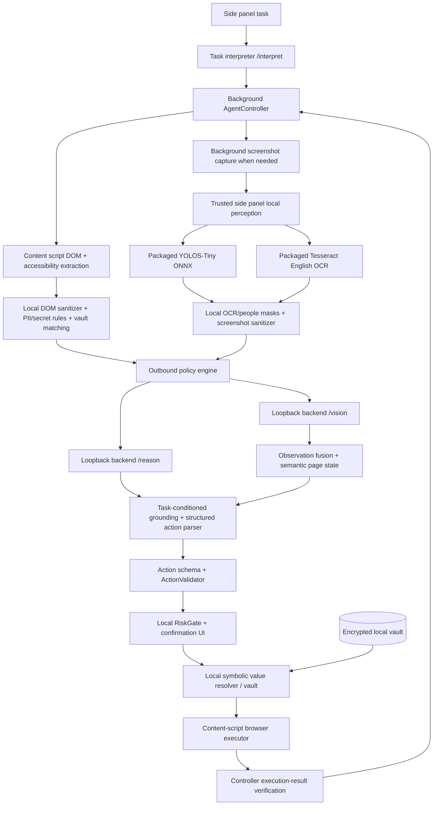
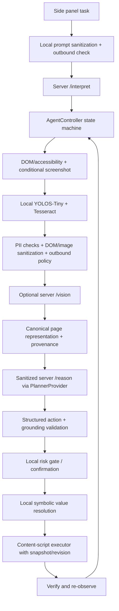

# PrivAgent architecture audit and RunAnywhere reference study

Audit date: 2026-09-29. This describes the current checkout, including pre-existing uncommitted work visible during the audit. No existing worktree changes were reverted or overwritten.

## Current PrivAgent architecture

### Audited module map

| Responsibility | Current implementation |
| --- | --- |
| Task understanding | `extension/reasoning/task-understanding.js`; `AgentController.startTask` calls the backend `/interpret` endpoint through `GPTOSSClient.interpretTask`. |
| Controller and task lifecycle | `extension/background/agent-controller.js` runs the loop; `extension/background/task-manager.js` persists task/settings state and timings. The controller has a large 1,800+ line module with observation, policy, planning, confirmation, execution, and recovery methods. |
| Page observation and DOM/accessibility | `extension/content/content.js` extracts interactive nodes, labels, ARIA names/description, fieldsets, options, visible text, headings, result cards, viewport and scroll data. It keeps a private per-document element registry. |
| Screenshot capture | `extension/perception/screenshot.js`, requested by the background controller only when DOM/intent indicates visual evidence is needed. |
| Local vision and OCR | `extension/perception/local-vision.js` runs packaged Xenova YOLOS-Tiny (`model_q4.onnx`) through Transformers.js and ONNX Runtime Web; packaged Tesseract 7 and English data run in the side panel. No external model assets are permitted. The current checkout has a pending WebGPU-first provider selection with WASM fallback. |
| Observation fusion and page model | `extension/perception/observation-fusion.js`, `page-state-modeler.js`, and `semantic-capability.js` fuse sanitized DOM, server visual output and task relevance. |
| Privacy / PII | `extension/privacy/pii-rules.js`, `pii-detector.js`, `secret-detector.js`, `dom-sanitizer.js`, `screenshot-sanitizer.js`, `policy-engine.js`. OCR values are used locally and discarded before IPC returns analysis. |
| Vault and symbolic values | `extension/privacy/local-vault.js`, `vault-crypto.js`, `extension/executor/local-value-resolver.js`. Vault values are AES-GCM encrypted at rest and resolved locally at execution time. |
| Server VLM and LLM | `extension/perception/vlm-client.js` calls `/vision`; `extension/reasoning/gpt-oss-client.js` calls `/interpret` and `/reason`. Backend model defaults are Qwen2.5-VL-72B-Instruct for vision and GPT-OSS-120B for reasoning, configurable by environment. |
| Semantic grounding | `extension/perception/task-grounding.js` plus `semantic-capability.js`; scores intent/action capability and filters incompatible controls. `extension/executor/action-validator.js` enforces action/element compatibility before the risk gate. |
| Structured action parsing | `extension/reasoning/action-parser.js`, `extension/shared/constants.js`, and `extension/shared/schemas.js`. The live schema has a wider legacy action set (for example form-plan and tab actions) than the narrow sample contract in the request. |
| Safety and execution | `extension/executor/action-validator.js`, `risk-gate.js`, `action-executor.js`; content execution is in `extension/content/content.js`. Destructive and sensitive actions require local confirmation according to the derived gate/settings. |
| Verification and replanning | Controller records execution success/failure and waits for page stability; the next loop iteration extracts a new DOM. It does not yet make the observation revision part of the action envelope. |
| Side panel and message authorization | `extension/sidepanel/{app.js,index.html,styles.css}`, `extension/background/message-router.js`, `extension/background/service-worker.js`. Page-originated messages are rejected from trusted extension-only operations; local vision is limited to the extension side panel. |
| Backend API | `backend/server.py`: `/vision`, `/reason`, `/interpret`, `/health`; no mounted `/agent` or browser execution endpoint. Request middleware checks extension origin, token, rate, and size. |
| Tests | Node unit/security suites under `tests/`, Python backend/security tests, and Python browser E2E/latency/visual suites. Separate Chrome and Firefox manifests exist. |

### Existing safeguards found

- Semantic grounding is task-conditioned and already covers search input versus nearby voice/microphone buttons, multiple candidates, result ranking and action compatibility.
- Content extraction clears and rebuilds the private element registry. Extraction and execution share an in-flight guard; execution rejects removed/unregistered elements and has no page-controlled-ID fallback.
- Navigation has a shared URL validator. The current uncommitted validator change also applies it to OPEN_TAB.
- Local DOM and screenshot analysis precede both model endpoints. Both model clients use the policy engine. The VLM outbound check requires a redaction audit next to any image bytes.
- Vault plaintext is absent from the reasoning request/action JSON. `LOCAL_*` values are looked up by the extension executor.
- The backend browser-agent routes are retired; the backend only provides model APIs and health status.
- Existing test suites already include many requested cases, including microphone/search ambiguity, select/radio/checkbox handling, sensitive DOM/screenshot payloads, vault resolution, symbolic values, outbound checks, action validation, and agent loop behavior. New coverage should target missing guarantees rather than duplicate these tests.

### Baseline gaps verified in the current checkout

- The controller uses phase states, but they are not a small explicit state machine with OBSERVE / UNDERSTAND / GROUND / PLAN / VALIDATE / EXECUTE / VERIFY / REPLAN / DONE / BLOCKED contracts. Several phases are reported as UI states while work remains inside `runSingleStep`.
- Content element IDs are positional and replaced on extraction. The controller validates an action against its just-built fused observation, but the observation has no opaque registry generation or mutation revision carried into content execution. A page mutation during remote reasoning or while confirmation is open can therefore leave an otherwise-connected control semantically stale.
- Fused elements omit several available fields (visible/enabled state, title, selected option, nearby text relationship and explicit provenance/confidence). The raw extractor has most of this information, but the canonical server-facing element shape does not consistently preserve it.
- VLM provenance currently uses `DOM_ONLY`, `DOM_PLUS_HEURISTIC`, and `DOM_PLUS_REAL_VLM` in different layers/docs. The real VLM claim is derived from the backend's `grounding_source`, but normalization should use one canonical vocabulary.
- A planner provider seam exists in the current uncommitted worktree, but the controller still calls `defaultGPTOSSClient.planNextStep` directly, so the seam is not yet the loop's actual dependency.

## RunAnywhere study

Primary sources studied:

- [RunAnywhere on-device browser agent](https://github.com/RunanywhereAI/on-device-browser-agent)
- [Its model sizing notes](https://github.com/RunanywhereAI/on-device-browser-agent/blob/master/docs/MODELS.md)
- [Its browser testing notes](https://github.com/RunanywhereAI/on-device-browser-agent/blob/master/docs/TESTING.md)
- [RunAnywhere Web SDK consumer app](https://github.com/RunanywhereAI/runanywhere-web)
- [RunAnywhere SDK monorepo](https://github.com/RunanywhereAI/runanywhere-sdks)

RunAnywhere describes the browser-agent project as a public Nanobrowser fork and explicitly credits Nanobrowser for its multi-agent browser automation, DOM serialization and extension foundation. Planner/navigator patterns, browser-agent loops and structured browser actions are established upstream architecture; they are not RunAnywhere inventions. RunAnywhere's relevant contribution is the on-device model runtime integration and its operational model lifecycle.

### What is useful for PrivAgent

- A narrow `ModelRuntime` / `InferenceProvider` boundary lets application code request a capability without embedding engine selection and model lifecycle in the UI/controller.
- Capability detection must test usable hardware/engine support, not only the presence of a browser API. RunAnywhere's browser docs distinguish WebGPU from CPU/WASM execution and warn that GPU availability and model compatibility are separate checks.
- Model loading, active model ownership, cache storage, download progress/resume, unload behavior and inference belong to the runtime boundary. They should not leak into a controller or page script.
- Structured model output still needs parsing and local validation. Provider selection cannot grant action authority or bypass the existing risk gate.
- Performance and memory must include both weights and inference/KV working memory, with the currently resident model count accounted for.
- Web runtime constraints differ from the SDK's native targets. RunAnywhere's browser-agent docs identify the WASM32 4 GiB linear-memory ceiling, with runtime and KV cache consuming headroom; they state only one model is resident for the agent's shared lifecycle.

### What should not be copied

- Do not replace PrivAgent's intentional hybrid model with RunAnywhere's default on-device-only privacy claim. PrivAgent needs its server reasoning path, but only after local sanitization and outbound policy enforcement.
- Do not copy Nanobrowser's planner/navigator foundation as if RunAnywhere originated it, and do not copy its full monorepo or browser extension.
- Do not adopt OPFS model downloads/cache as a default: the current PrivAgent model assets ship with the extension and its local perception is offline-capable. Runtime downloads add a large new network, consent, integrity, storage, resume and privacy surface.
- Do not assume RunAnywhere's browser-agent compatibility applies to Firefox. The browser-agent testing docs say Chrome/Edge only because of its offscreen document, WebGPU and OPFS choices. The separate `runanywhere-web` app/SDK supports a broader browser matrix, but that is not proof the extension architecture does.
- Do not assume a WebGPU API being present means the ONNX model/provider can initialize or that it is faster. Keep a working local WASM path and benchmark both.
- Do not copy the SDK's Web CUA scaffolding as an autonomous agent framework. The current SDK describes Web CUA as API-only; its browser agent also notes that a catalogued Fara model exceeds the WASM32 budget and has no seeded Web CUA model.

### Referenced models and browser fit

The browser-agent testing/model documentation identifies these exact references:

| RunAnywhere reference | Documented quantization / download size | Use in the reference docs |
| --- | --- | --- |
| Qwen3.5-4B | Q4_K_M, 2.55 GB | Current default |
| LFM2.5-1.2B | Q5_K_M, 0.79 GB | Smaller fast-start option |
| Qwen3-0.6B | Q4_K_M, about 397 MB (0.37 GB) | Lightweight pipeline/plumbing option, deliberately weak for navigation |

The broader SDK catalog/support also discusses families including Qwen 2.5, Llama 3.2, LFM2 and SmolLM (alongside other families). These are reference information only; none is added to PrivAgent.

The current packaged extension is about 48.1 MB unpacked. It already includes about 28.4 MB of ONNX Runtime Web WASM, a 7.8 MB YOLOS-Tiny ONNX model, and Tesseract/OCR assets. There is no declared bundle-size budget in this project, so a numeric "remaining bundle allowance" does not exist. There is also no resident LLM or model-download/cache subsystem. The RunAnywhere reference weights would add roughly 397 MB to 2.55 GB per selected model before cache and KV/working memory. A WASM32 runtime has a 4 GiB address-space ceiling, and the model shares it with KV cache and runtime staging; large model support would need explicit device-memory and context admission logic. Runtime model downloads would change PrivAgent's packaged/offline guarantee. Therefore no local LLM is installed or enabled.

### Attribution and documentation caveat

The browser-agent README contains status prose describing inference as still being wired, while its current model/testing documents describe model download, OPFS caching, WASM/WebGPU selection and manual browser testing in detail. Treat the model and testing documents as technical descriptions of the current design, but do not infer from those docs that every listed CUA/model profile is available or verified. The browser-agent repository is a technical reference for browser-based on-device inference using WASM/WebGPU and model-runtime architecture.

## Current PrivAgent model/runtime inventory

| Capability | Current implementation |
| --- | --- |
| Local object detection | Xenova YOLOS-Tiny Q4 ONNX, pinned revision, loaded from packaged extension assets via Transformers.js/ONNX Runtime Web. Runtime remote-model loading is disabled. |
| Local OCR | Tesseract.js 7 with packaged English model data and WASM. OCR text is transient inside local screenshot analysis. |
| Local LLM/VLM | None. |
| Server VLM | Qwen2.5-VL-72B-Instruct default, configurable/provider-rotated in the backend. It receives only the screenshot after the local sanitizer has permitted it, plus sanitized DOM/context. |
| Server reasoning/planning | GPT-OSS-120B default, configurable in the backend. `/interpret` and `/reason` receive sanitized task/page context. |
| WebGPU/WASM | The local-vision runtime prefers an actual WebGPU adapter and requests the same packaged ONNX pipeline with `device: webgpu`; pipeline initialization falls back to `device: wasm`. Firefox without WebGPU continues through WASM. There is no benchmark proving WebGPU is faster. |

## Code changes after the audit

The audit identified two functional gaps, so the implementation changes attach to those seams rather than replacing PrivAgent's architecture:

- `extension/agent/state-machine.js` defines the explicit per-step states `OBSERVE`, `UNDERSTAND`, `GROUND`, `PLAN`, `VALIDATE`, `EXECUTE`, `VERIFY`, `REPLAN`, `DONE`, and `BLOCKED`. The controller now advances those states and persists the current phase.
- `extension/agent/verifier/action-verifier.js` compares the pre-action sanitized observation with the next fresh, fused observation before another plan is requested. It records whether visible page/target state changed and avoids claiming that a dispatched click achieved a site-level goal.
- DOM extraction now returns an opaque `snapshot_id` plus `mutation_revision`. Fusion preserves both, the controller carries them into execution, and the content executor rejects actions if either value is stale. Targeted actions recheck after scrolling, and form plans stop when an intervening page mutation invalidates the remaining element map.
- `extension/perception/provenance.js` normalizes provenance to `DOM_ONLY`, `DOM_PLUS_HEURISTIC`, `REAL_VLM`, `LOCAL_MODEL`, and per-element `DOM`. The backend labels its heuristic annotations as DOM annotations and emits an empty screenshot-detection list. Fusion accepts screenshot element detections only with both real-VLM and detection provenance.
- `extension/runtime/capability-detection.js` and `model-runtime.js` move packaged ONNX capability checks and load/fallback policy behind `ModelRuntime` and `InferenceProvider`. WebGPU is attempted only after a real adapter is returned; failed initialization falls through to WASM. Packaged model loading keeps remote assets disabled and the browser cache off.
- `extension/perception/perception-provider.js` is the local perception interface. `LocalVisionEngine` uses the ONNX provider while Tesseract/OCR, screenshot redaction, privacy policy, and vault remain where they are.
- `extension/reasoning/providers/planner-provider.js` now sits on the controller's live path. The production chain is an explicitly disabled provider, an inert `FutureRunAnywherePlannerProvider`, and the existing server planner. The provider receives the same sanitized context, and the action still has to pass the local schema/grounding/risk/executor path.
- The side panel's existing `ASK_USER` answer path now gates user-selected candidate clicks and sends field answers through one local form-plan execution, without adding answer text to task history. That form plan shares the observation revision and cannot keep using stale targets after a page mutation.
- DOM sanitization now applies to canonical accessible name, text, title, and selected-option fields as well as the original field/value fields.

Added regression tests cover state-machine transitions, stale snapshot/revision rejection, DOM heuristic versus real-VLM provenance, packaged WebGPU-to-WASM fallback, no remote model loading, and PII in canonical DOM fields. Existing semantic, vault, privacy, safety, and browser-flow coverage remains in the full suite.

The packaged bundle grew by about 34 KB. A local-only headless Chromium smoke measured DOM extraction, local object detection, OCR, screenshot sanitization, JS heap use, and WASM execution; detailed values and the missing pre-change/runtime backend trace are recorded in [architecture.md](architecture.md#measurements). No local LLM model or download/cache subsystem was added.

## Resulting architecture map

The image-free path skips `/vision` and fuses sanitized DOM with `DOM_ONLY` or `DOM_PLUS_HEURISTIC` provenance. A server VLM layout summary is not treated as a detection list. Local private values remain behind the vault/executor boundary.
