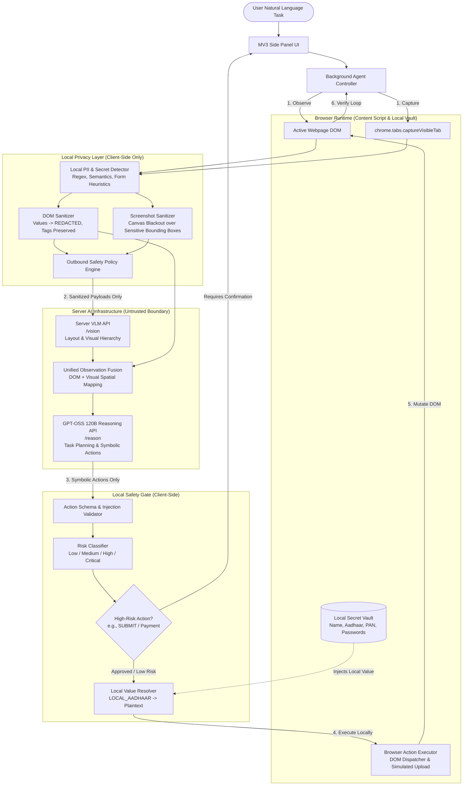

# System Architecture: Privacy-Preserving Agentic Browser Extension

## 1. Architectural Overview

The **Privacy-Preserving Agentic Browser Extension** is engineered as a Chromium Manifest V3 extension paired with an external server perception/reasoning cluster (VLM + GPT-OSS 120B). It enables autonomous multi-step execution of user tasks while enforcing an uncompromising **Local Privacy Boundary**.



---

## 2. Core Architectural Components

### A. Dual Perception Engine (DOM + VLM Together)
Existing browser agents either rely purely on DOM (failing on canvas, SVG, custom widgets, or complex visual layouts) or treat VLM as a slow, expensive fallback. 
In this architecture:
- **Every observation cycle** triggers both DOM extraction and viewport screenshot capture.
- The DOM captures explicit semantic hierarchies, input types, ARIA accessibility attributes, exact text labels, and bounding boxes.
- The VLM captures spatial relationships, visual weight, visual button boundaries, icons, modals, and graphical elements.
- **Observation Fusion** combines these perception sources into a unified observation JSON schema.

### B. Local Privacy Layer (The Core Differentiator)
Before any data leaves the user's browser:
1. **PII & Secret Detection**:
   - Analyzes DOM element tags, name/id/autocomplete attributes, placeholder text, ARIA attributes, and text values.
   - Evaluates text patterns against Indian government identifier algorithms (Aadhaar 12-digit Verhoeff format, PAN 10-character alphanumeric `[A-Z]{5}[0-9]{4}[A-Z]{1}`), international card numbers (Luhn), passwords, OTPs, phone numbers, and emails.
2. **DOM Sanitization**:
   - Replaces plaintext values with `[REDACTED]`.
   - Associates the element with a symbolic identifier: `value_source: "LOCAL_AADHAAR"`.
   - Strips hidden session tokens and cookies from the serialized tree.
3. **Screenshot Sanitization**:
   - Uses detected sensitive element coordinates to render solid blackout masks (`█████████`) over sensitive form input boxes and values using an OffscreenCanvas.
   - Preserves labels, buttons, and layout hierarchy so the remote VLM can interpret page context without viewing confidential user data.
4. **Outbound Network Policy**:
   - An interceptor scans every payload destined for `/vision` and `/reason` to guarantee no unmasked secret matches exist.

### C. Symbolic Local Value Resolution
- The reasoning model (GPT-OSS 120B) does not know, and does not need to know, the user's actual Aadhaar number, PAN, password, or uploaded file data.
- The model outputs an action plan specifying symbolic source references:
  ```json
  {
    "action": "TYPE",
    "target": { "element_id": "el_102", "label": "Aadhaar Number" },
    "value_source": "LOCAL_AADHAAR",
    "risk": "SENSITIVE",
    "requires_confirmation": false
  }
  ```
- The local executor reads `LOCAL_AADHAAR` from the user's secure in-memory browser vault and dispatches input events directly to the DOM.

### D. Local Action Safety Gate & Risk Classification
All actions generated by the reasoning model pass through a deterministic security gate:
- **Schema Validation**: Rejects arbitrary code, unrecognized verbs, and malformed parameters.
- **Prompt Injection Defense**: Untrusted page text is quarantined inside explicit XML tags (`<untrusted_webpage_content>`) in prompts, and instructions extracted from web pages are forbidden from issuing high-risk actions.
- **Risk Classification**:
  - `LOW`: Scroll, hover, focus, wait, low-risk clicks (tabs, navigation menus).
  - `MEDIUM`: Typing non-sensitive query text into search boxes.
  - `HIGH`: Typing sensitive credentials, selecting document upload, submitting non-critical forms.
  - `CRITICAL`: Submitting financial, identity, or legal forms (`SUBMIT`, purchase checkout, password change, document upload).
- Any action flagged as requiring user confirmation halts the agent in `WAITING_FOR_USER` state and prompts the user in the Side Panel with full transparency:
  - **What will happen**: e.g., "Submit Application on uidai.gov.in"
  - **Data staying local**: e.g., Aadhaar Number, Full Name, DOB
  - **Data shared with AI**: e.g., Sanitized form layout only

---

## 3. Agent State Machine

```mermaid
stateDiagram-v2
    [*] --> IDLE
    IDLE --> UNDERSTANDING_TASK : User submits task
    UNDERSTANDING_TASK --> OBSERVING : Task parsed & decomposed
    OBSERVING --> SANITIZING : DOM & Screenshot captured
    SANITIZING --> VISUAL_ANALYSIS : PII masked; dispatch /vision
    VISUAL_ANALYSIS --> REASONING : Fused observation ready
    REASONING --> PLANNING : GPT-OSS 120B reasoning
    PLANNING --> VALIDATING_ACTION : Action plan generated
    VALIDATING_ACTION --> WAITING_FOR_USER : High-risk action detected
    WAITING_FOR_USER --> EXECUTING : User approved action
    WAITING_FOR_USER --> CANCELLED : User rejected action
    VALIDATING_ACTION --> EXECUTING : Low-risk action approved
    EXECUTING --> VERIFYING : DOM mutation dispatched
    VERIFYING --> OBSERVING : More steps needed
    VERIFYING --> COMPLETED : Goal reached (DONE action)
    EXECUTING --> FAILED : Execution timeout / error
    FAILED --> OBSERVING : Retry budget available
    FAILED --> [*] : Retry exhausted
    COMPLETED --> [*]
```



---

## 4. Network API Specification

### Endpoint 1: `POST /vision`
- **Purpose**: Process redacted screenshot + sanitized DOM to extract visual UI hierarchy and spatial relationships.
- **Request**:
  ```json
  {
    "task_id": "task_abc123",
    "sanitized_screenshot": "data:image/webp;base64,...",
    "sanitized_dom": { "elements": [...] },
    "metadata": { "viewport": { "width": 1280, "height": 800 } }
  }
  ```
- **Response**:
  ```json
  {
    "visual_observation": {
      "detected_elements": [
        { "visual_id": "vis_01", "role": "button", "label": "Submit", "bbox": [500, 620, 120, 38], "confidence": 0.98 }
      ],
      "spatial_layout": "Form layout with 4 vertical input fields and 1 primary submit button at bottom-right",
      "visual_state": "All required fields filled, submit button is active"
    }
  }
  ```

### Endpoint 2: `POST /reason`
- **Purpose**: Consumes fused observation, plan next action, and generate symbolic execution step.
- **Request**:
  ```json
  {
    "task": "Fill this application using my saved profile",
    "task_id": "task_abc123",
    "fused_observation": {
      "elements": [...],
      "visual_summary": "..."
    },
    "history": [ ... ]
  }
  ```
- **Response**:
  ```json
  {
    "thought": "The form requires an Aadhaar number. Field el_002 matches. I will output a TYPE action using LOCAL_AADHAAR.",
    "action": {
      "action": "TYPE",
      "target": { "element_id": "el_002", "label": "Aadhaar Number" },
      "value_source": "LOCAL_AADHAAR",
      "risk": "HIGH",
      "requires_confirmation": false
    },
    "is_terminal": false
  }
  ```
