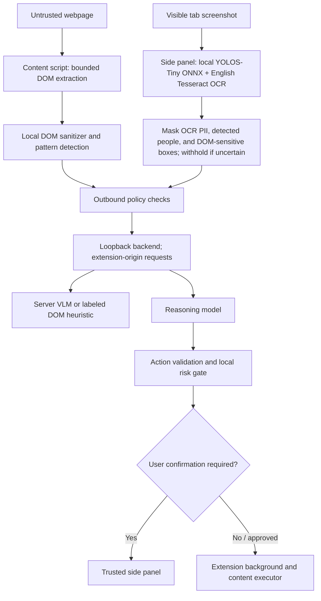

# Architecture

## Supported execution path

The server-driven `/agent` loop has been removed. It previously captured raw screenshots and could continue after logging a high-risk action. The side panel is the only UI allowed to issue user controls, vault reads/writes, or settings changes. The same panel runs the local screenshot analysis request from the extension background; webpage content scripts and page-originated messages cannot invoke it.

## Privacy processing

The content script extracts interactive controls and selected page text. The background passes each screenshot to the open extension side panel, where a packaged YOLOS-Tiny object detector and Tesseract OCR run locally. OCR plaintext is used transiently for local pattern matching and discarded before the panel replies. The local result retains object labels, PII categories, counts, confidences, timings, and boxes. The sanitizer masks sensitive DOM controls, OCR-matched text, and detected people using full person boxes.

If local analysis fails, the task stops before any screenshot is sent to the server. If OCR cannot locate a recognized sensitive value, its count does not match the DOM text audit, or a canvas/video surface is present, the server receives a neutral placeholder instead of the screenshot. These controls reduce exposure but cannot detect every arbitrary secret or visual PII value.

The backend binds to loopback by default and accepts model requests only from Chrome or Firefox extension origins. It rejects common unredacted patterns in DOM payloads. Those checks are defense in depth, not proof that an arbitrary image is sanitized. The boundary assumes the installed extension is trusted and unmodified.

## Perception provenance

- `DOM_ONLY`: the server VLM request failed. Local object/OCR annotations still ran, but no server VLM result is claimed.
- `DOM_PLUS_HEURISTIC`: the backend produced a DOM-derived layout summary without a server VLM result.
- `DOM_PLUS_REAL_VLM`: a configured server vision model returned visual analysis.

The controller captures, locally analyzes, and sanitizes a screenshot on every observation before requesting the VLM endpoint. YOLOS-Tiny provides general COCO object labels, not face or UI-control detections. The backend labels its DOM-derived response as a heuristic. Server VLM availability depends on backend configuration and provider response.

## Local values and uploads

Symbolic values are resolved in the extension immediately before DOM input. Vault values are stored in `chrome.storage.local` without module-provided encryption. The vault starts empty. `LOCAL_DOCUMENT` is not backed by a real file picker and fails closed; users may choose a document directly on the website, outside the extension's handling.

## Limits

The shared local rule registry covers Aadhaar, PAN, US SSN, Canadian SIN, UK NIN/NHS, IBAN, cards, email, supported phone formats, DOB, and IFSC patterns, plus semantic field labels and configured vault strings. The registry is extensible, but coverage remains finite; OCR is English-only. Name/address/account recognition is heuristic. YOLOS masks people with their full detected box; it is not a face detector. Arbitrary sensitive prose and text in images may be missed. See [privacy-model.md](privacy-model.md) for claim status and coverage.
