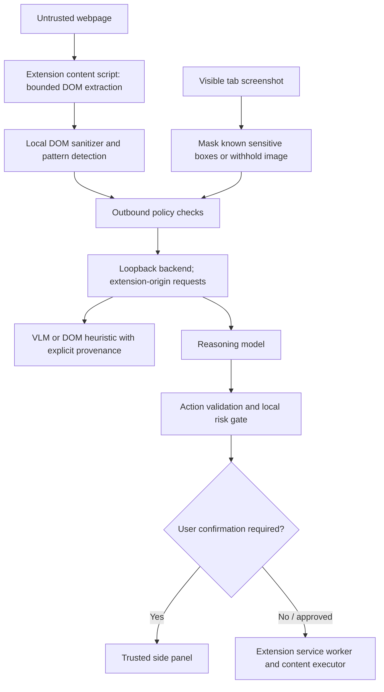

# Architecture

## Supported execution path

The server-driven `/agent` loop has been removed. It previously captured a raw screenshot and could continue after logging a high-risk action. The supported browser-control messages enter through `extension/background/message-router.js`; only the exact extension side-panel page may issue user controls, vault reads/writes, or settings changes. Content-script and webpage-originated messages are rejected.

## Privacy processing

The content script extracts interactive controls and selected page text. The extension sanitizes known sensitive values and fields, applies the outbound policy to model payloads, then submits the resulting representation to the backend. Screenshot redaction masks known sensitive element boxes. Known sensitive text without a location and canvas/video surfaces cause screenshot withholding. This is not OCR; the extension cannot guarantee detection of arbitrary text in normal page content or images.

The backend binds to loopback by default and accepts model API requests only with a Chrome extension origin. It rejects common unredacted patterns in DOM payloads. These checks are defense in depth, not cryptographic proof that an arbitrary image is sanitized. The privacy boundary assumes the installed extension is trusted and unmodified.

## Perception provenance

- `DOM_ONLY`: no image analysis; used by the fast path or when remote visual analysis fails.
- `DOM_PLUS_HEURISTIC`: backend layout inference from DOM; no visual-model detections are claimed.
- `DOM_PLUS_REAL_VLM`: a configured vision model returned visual analysis.

The client never creates synthetic visual detections for DOM-only execution. The backend labels its DOM-derived response as a heuristic. Actual VLM availability depends on backend configuration and provider response.

## Local values and uploads

Symbolic values are resolved in the extension immediately before DOM input. Vault values are stored in `chrome.storage.local` without module-provided encryption. The vault starts empty. `LOCAL_DOCUMENT` is not backed by a real file picker and fails closed; users may choose a document directly on the website, outside the extension's handling.

## Limits

Pattern detection covers common Aadhaar, PAN, card, email, phone, DOB, and token forms, plus semantic field labels and configured vault strings. Name/address/account recognition is heuristic. Arbitrary sensitive prose and text rendered inside images cannot be reliably detected. See [privacy-model.md](privacy-model.md) for claim status and coverage.
