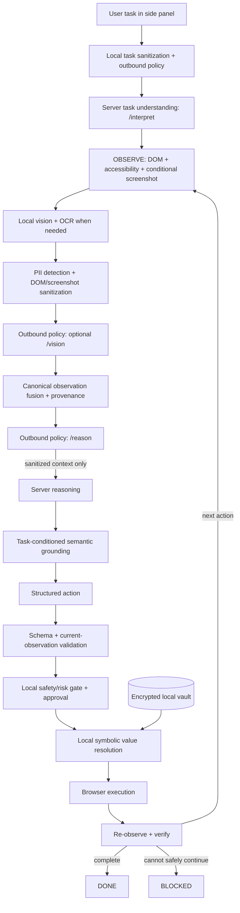

# PrivAgent Architecture

PrivAgent keeps page access, privacy decisions, profile data, action approval, and browser execution in the extension. The loopback backend provides optional, stronger model reasoning over sanitized context.


```mermaid
flowchart TD
  User[User task in side panel] --> TaskPrivacy[Local task sanitization + outbound policy]
  TaskPrivacy --> Understand[Server task understanding: /interpret]
  Understand --> Observe[OBSERVE: DOM + accessibility + conditional screenshot]
  Observe --> Local[Local vision + OCR when needed]
  Local --> Privacy[PII detection + DOM/screenshot sanitization]
  Privacy --> OutboundVision[Outbound policy: optional /vision]
  OutboundVision --> Fuse[Canonical observation fusion + provenance]
  Fuse --> OutboundReason[Outbound policy: /reason]
  OutboundReason -->|sanitized context only| Server[Server reasoning]
  Server --> Ground[Task-conditioned semantic grounding]
  Ground --> Plan[Structured action]
  Plan --> Validate[Schema + current-observation validation]
  Validate --> Risk[Local safety/risk gate + approval]
  Risk --> Resolve[Local symbolic value resolution]
  Resolve --> Execute[Browser execution]
  Execute --> Verify[Re-observe + verify]
  Verify -->|next action| Observe
  Verify -->|complete| Done[DONE]
  Verify -->|cannot safely continue| Blocked[BLOCKED]
  Vault[(Encrypted local vault)] --> Resolve
```

## Controller states and freshness

`extension/background/agent-controller.js` runs an explicit per-step state machine: `OBSERVE → UNDERSTAND → GROUND → PLAN → VALIDATE → EXECUTE → VERIFY → REPLAN`. `DONE` and `BLOCKED` are terminal outcomes. Each state is recorded on the task for diagnostics.

An extraction carries an opaque `snapshot_id` and a page `mutation_revision`. Fusion preserves them as `observation_id` and `mutation_revision`; the background passes this pair to the content executor for every observation-bound action. The content script checks both immediately before acting and again after scrolling a target into view. A stale snapshot, page mutation, or invalid element ID fails closed so the controller must observe and ground again. Form plans also recheck freshness between fields and stop when a page mutation invalidates the remaining targets.

After an execution result, the controller saves only safe action metadata and a sanitized pre-action observation in memory. The next step captures, fuses, and grounds a fresh observation first; `ActionVerifier` then compares visible state and target state before the planner receives the next action request. It reports an observed state change or no visible change and does not claim that a dispatched click achieved the site's intended outcome.

The page representation contains the element ID, tag/role, accessible name, label and nearby text, placeholder/title, type/href, geometry, visibility and enabled state, selected/checked state, options, and local DOM relationships. Sensitive values are represented as `[REDACTED]` and/or symbolic `LOCAL_*` tokens. The server never receives vault plaintext.

## Privacy and outbound boundary

The normal request path is:

```text
page → DOM/accessibility extraction → local PII and secret checks
     → conditional screenshot capture → local object/OCR analysis
     → DOM and screenshot sanitization → outbound policy check
     → /vision and/or /interpret, /reason with sanitized payloads
```

`extension/perception/vlm-client.js` is the only screenshot VLM client. `extension/reasoning/gpt-oss-client.js` owns task interpretation and reasoning requests. Both call the shared outbound policy engine immediately before `fetch`. Local perception asset reads are restricted to packaged extension assets; there is no runtime model download path. The legacy `/agent` browser-execution endpoint is not mounted by the backend.

The browser executor resolves `LOCAL_*` tokens from the encrypted local vault immediately before a write. Vault values do not enter model prompts, server requests, task history, or telemetry. The backend does not execute browser actions.

## Perception provenance

Fused observations use one canonical provenance vocabulary:

- `DOM_ONLY`: no real remote VLM result was used.
- `DOM_PLUS_HEURISTIC`: a deterministic DOM-derived layout summary was used.
- `REAL_VLM`: a remote vision model returned visual analysis. Screenshot-derived element detections are admitted only when the result separately marks `detected_elements_provenance: REAL_VLM`.
- `LOCAL_MODEL` identifies packaged local perception metadata, not remote VLM output.

The current VLM backend's heuristic emits DOM annotations, not screenshot-derived control boxes. Fusion keeps those annotations as DOM context and does not fabricate visual detections or confidence scores. If the VLM fails, the fallback keeps `DOM_ONLY` provenance.

## Models and runtime

PrivAgent currently uses:

- **Local vision:** Xenova YOLOS-Tiny, quantized Q4 ONNX, pinned revision, loaded from packaged extension assets through Transformers.js and ONNX Runtime Web.
- **Local OCR:** packaged Tesseract.js 7 with English language data and WASM. OCR text is consumed locally and discarded.
- **Server VLM:** Qwen2.5-VL-72B-Instruct by default, configurable in the backend.
- **Server reasoning:** GPT-OSS-120B by default, configurable in the backend.
- **Local LLM:** none.

`extension/runtime/` separates capability detection and packaged model lifecycle from perception. ONNX uses WebGPU when an adapter is available and the pipeline initializes; it falls back to WASM on initialization failure. Firefox remains on WASM when WebGPU is unavailable, and its WASM path does not depend on RunAnywhere's Chrome/Edge-only offscreen/OPFS design. No benchmark in this checkout establishes that WebGPU is faster.

The extension is about 48.1 MB unpacked. RunAnywhere's browser-agent docs reference Qwen3.5-4B Q4_K_M at 2.55 GB, LFM2.5-1.2B Q5_K_M at 0.79 GB, and Qwen3-0.6B Q4_K_M at about 397 MB. PrivAgent has no declared bundle allowance, no local LLM runtime, and no model download/cache system. Adding one of those models would materially change package size, memory, startup, download, caching, and offline behavior, so the production reasoning path remains the server provider. The disabled `FutureRunAnywherePlannerProvider` is an explicit future seam, not an installed model.

## Measurements

The audit recorded baseline packaged sizes of 48,059,440 bytes (Chrome) and 48,059,581 bytes (Firefox). After the changes and final packaging, the sizes are 48,093,748 bytes and 48,093,889 bytes respectively: **+34,308 bytes** per package (about 0.071%). No project bundle-size budget is declared.

A local-only smoke benchmark ran the packaged Chrome extension in headless Chromium 1243 with GPU disabled, using a synthetic 640×360 image and a synthetic page with 80 inputs. Results were one environment sample, not a cross-device guarantee:

| Measurement | Observed result |
| --- | ---: |
| DOM extraction, 80 inputs | 3 ms median after initial stability wait (first capture 206 ms including the 200 ms quiet wait) |
| YOLOS-Tiny model load | 778 ms cold; 0 ms warm |
| Local object detection | 7,020 ms |
| Tesseract OCR | 100 ms |
| Combined local perception | 7,858 ms cold; 6,820 ms warm |
| Screenshot sanitization | 22 ms |
| Reported JS heap | 36.4 MB after first run; 83.7 MB after warm run |
| Packaged local vision assets | 47,414,288 bytes |
| WebGPU | API present; adapter unavailable in this GPU-disabled run |
| ONNX execution provider | WASM, confirmed by the local engine |

The measured object-detection latency is the main local perception cost in this headless CPU run. The repository had no comparable pre-change browser latency trace, so no before/after speedup is claimed. Server reasoning and end-to-end task latency were not measured because this checkout has no backend process or configured backend credentials. The live Chromium agent E2E suites therefore skipped; the local extension runtime smoke did execute in Chromium. There is no Firefox E2E harness in the repository; the Firefox package built successfully and the no-WebGPU/WASM fallback is unit-tested.

## Related audit

See [architecture-audit-runanywhere.md](architecture-audit-runanywhere.md) for the before-state map, detailed RunAnywhere attribution, model-size notes, and code-level changes made after that audit.
