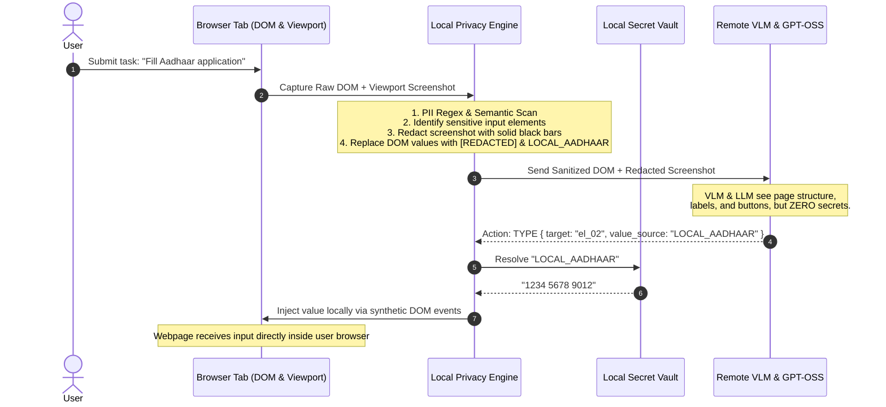

# Privacy Model & Data Boundary Specification

## 1. Core Principle: Zero Knowledge of Secrets by Remote Models

Existing commercial browser agents send raw web session data, unredacted full-page screenshots, and full HTML markup to remote LLMs. When users execute tasks like:
- "Fill my passport or Aadhaar application"
- "Pay for my flight tickets"
- "Upload my tax returns or identity PDF"

they inadvertently transmit government IDs, financial credentials, full addresses, session cookies, and private documents to third-party model servers.

The **Privacy-Preserving Agentic Browser Extension** reverses this paradigm:
> **"Remote AI models provide perception and reasoning; the local browser extension owns, safeguards, and executes secrets."**

---

## 2. Classification Matrix: What Stays Local vs. What Leaves the Browser

| Data Category | Specific Items | Storage & Processing Location | Transmitted to Remote AI? |
| :--- | :--- | :--- | :--- |
| **Government Identifiers** | Aadhaar numbers, PAN cards, Voter ID, Passport numbers | Local In-Memory Vault | ❌ **NEVER** |
| **Authentication Credentials** | Passwords, OTPs, PINs, 2FA tokens, session cookies | Local In-Memory Vault | ❌ **NEVER** |
| **Financial Data** | Credit/Debit Card numbers, CVVs, Expiry dates, Bank accounts | Local In-Memory Vault | ❌ **NEVER** |
| **Identity Documents** | Aadhaar PDF, PAN scans, tax certificates, utility bills | Local File System | ❌ **NEVER** |
| **Personal Contact Info** | Full address, private phone numbers, personal email | Local Vault | ❌ **NEVER** (Replaced by `LOCAL_PROFILE`) |
| **Visual Form Values** | Rendered input text on webpage screenshots | Redacted locally on Canvas (`████`) | ❌ **NEVER** (Masked prior to transmission) |
| **Page Layout & Geometry** | Element bounding boxes, dimensions, positions | Processed into semantic schema | ✅ **YES** (Sanitized geometry only) |
| **Semantic Labels & Roles** | "Aadhaar Number", "Submit", "Flight Origin", "textbox" | Processed into semantic schema | ✅ **YES** (Labels needed for semantic reasoning) |
| **Redacted Screenshot** | Layout image with sensitive input fields blacked out | Offscreen Canvas export | ✅ **YES** (Required for spatial VLM grounding) |
| **User Task Intent** | "Fill this form using my profile", "Find flights" | User input prompt | ✅ **YES** (Required for goal decomposition) |

---

## 3. The Local Privacy Pipeline

---

## 4. Local Secret Vault & Symbolic Token Lifecycle

1. **Vault Storage**:
   - Stored in sandboxed extension storage (`chrome.storage.local` with optional AES-GCM encryption key derived from a user master PIN).
   - In-memory cache cleared when the extension closes or after inactivity timeout.
2. **Symbolic Tokens**:
   - `LOCAL_AADHAAR`
   - `LOCAL_PAN`
   - `LOCAL_FULL_NAME`
   - `LOCAL_DOB`
   - `LOCAL_PHONE`
   - `LOCAL_EMAIL`
   - `LOCAL_ADDRESS`
   - `LOCAL_PASSWORD`
   - `LOCAL_DOCUMENT`
3. **Strict Resolution Boundary**:
   - No symbolic token is ever resolved outside the `local-value-resolver.js` module.
   - Symbolic tokens are mapped to actual values *immediately* prior to DOM input dispatch.
   - Logs generated by the extension replace the value with `[RESOLVED_LOCAL_VALUE]` or log only the token name (`Resolved: LOCAL_AADHAAR`).

---

## 5. Screenshot Redaction Mechanism

When `chrome.tabs.captureVisibleTab` captures the current viewport:
1. The DOM perception engine identifies all elements tagged as `sensitive: true`.
2. Their viewport-relative bounding boxes `[x, y, width, height]` are calculated via `getBoundingClientRect()`.
3. An `OffscreenCanvas` (or hidden canvas element) draws the viewport image.
4. For each sensitive bounding box:
   - The bounding box region is padded by 4px on each side.
   - A solid `#000000` (black) rectangle is rendered over the box.
   - A subtle contrasting text indicator `[REDACTED]` is overlaid for VLM interpretability.
5. The resulting redacted image is exported as a lightweight compressed WebP data URL.
6. The remote VLM is able to observe:
   - "There is an input box labeled 'Aadhaar Number' at coordinates [120, 240, 300, 36]."
   - "The input box has already been filled (or is empty)."
   - But the VLM **cannot read the numbers or characters**.
